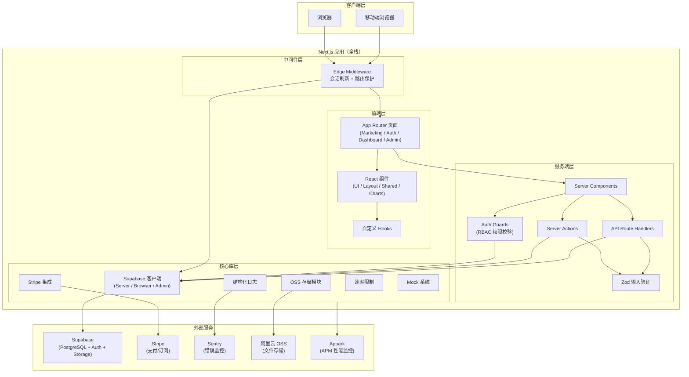
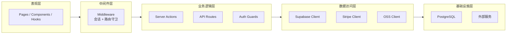
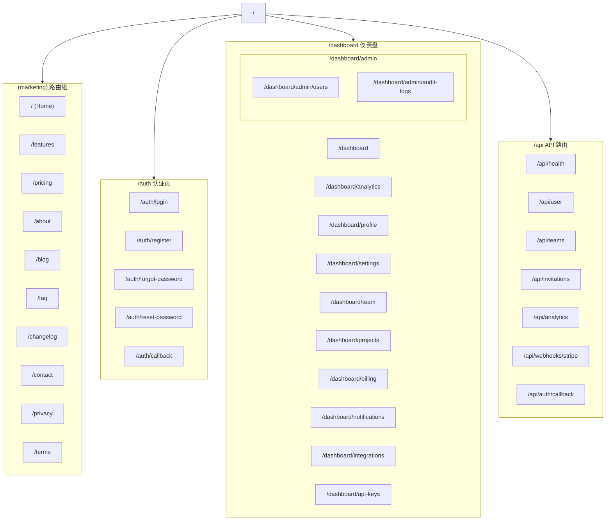
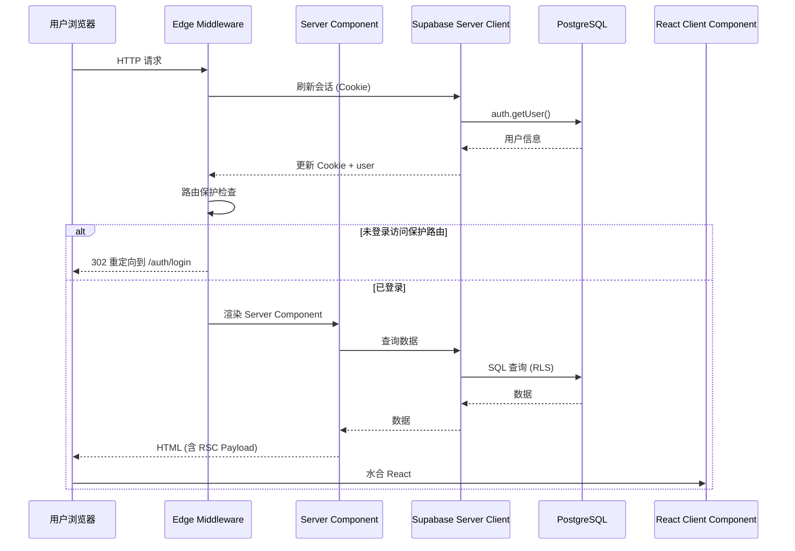

# 总体架构概览

> IndieStack — 面向独立开发者的生产级 SaaS 启动模板

## 架构定位

IndieStack 是一个全栈 SaaS 应用模板，采用 **Next.js App Router** 全栈架构，前后端一体化部署。核心理念是让独立开发者能够快速启动一个包含认证、支付、团队管理、国际化、监控等完整功能的生产级应用。

## 系统架构图

## 架构分层

项目分为五个清晰的层次：

1. **表现层** — App Router 页面、React 组件、自定义 Hooks，负责 UI 渲染和用户交互
2. **中间件层** — Edge Middleware，处理会话刷新和路由级保护，在每个请求到达页面前执行
3. **业务逻辑层** — Server Actions、API Route Handlers、Auth Guards，处理业务逻辑和权限校验
4. **数据访问层** — Supabase 客户端（Server/Browser/Admin）、Stripe 客户端、OSS 客户端，封装外部服务访问
5. **基础设施层** — PostgreSQL 数据库、Stripe 支付网关、Sentry 错误监控、阿里云 OSS、Appark APM

## 核心设计原则

- **全栈一体化** — 前后端代码在同一仓库，通过 Server Components 和 Server Actions 消除 API 边界
- **类型安全** — TypeScript 严格模式贯穿全栈，Supabase 数据库类型自动生成
- **Cookie 会话** — 使用 `@supabase/ssr` 基于 Cookie 的会话管理，适配 Server Components
- **RBAC 权限** — 四级角色体系（super_admin / admin / member / viewer），细粒度权限控制
- **Mock 开发模式** — 无需真实后端即可本地开发，通过环境变量切换
- **国际化** — `next-intl` Cookie 策略，URL 无语言前缀，支持中英文
- **安全优先** — 速率限制、输入验证（Zod）、安全 Headers、RLS 策略

## 技术栈速览

| 层级 | 技术 | 版本 |
|------|------|------|
| 框架 | Next.js (App Router) | ^15.2.0 |
| 语言 | TypeScript | ^5.7.3 |
| UI | React + Tailwind CSS + shadcn/ui | React ^19.0.0 |
| 数据库 | PostgreSQL (via Supabase) | Supabase ^2.49.1 |
| 认证 | Supabase Auth (Cookie SSR) | @supabase/ssr ^0.6.1 |
| 支付 | Stripe | ^22.3.2 |
| 国际化 | next-intl | ^4.13.2 |
| 错误监控 | Sentry | @sentry/nextjs ^9.5.0 |
| 文件存储 | 阿里云 OSS | 自定义封装 |
| 性能监控 | Appark APM | 自定义封装 |
| 测试 | Vitest + @faker-js/faker | Vitest ^4.1.10 |
| 包管理 | pnpm | — |
| 部署 | Docker / Vercel | — |

## 页面路由分组

## 关键数据流

## 文档导航

| 文档 | 内容 |
|------|------|
| [02-tech-stack.md](./02-tech-stack.md) | 技术栈详解 |
| [03-project-structure.md](./03-project-structure.md) | 目录结构说明 |
| [04-routing.md](./04-routing.md) | 路由体系 |
| [05-auth-rbac.md](./05-auth-rbac.md) | 认证与 RBAC 权限系统 |
| [06-database.md](./06-database.md) | 数据库设计 |
| [07-api-routes.md](./07-api-routes.md) | API 路由设计 |
| [08-server-actions.md](./08-server-actions.md) | Server Actions |
| [09-frontend-components.md](./09-frontend-components.md) | 前端组件体系 |
| [10-i18n.md](./10-i18n.md) | 国际化方案 |
| [11-integrations.md](./11-integrations.md) | 第三方集成 |
| [12-deployment.md](./12-deployment.md) | 部署架构 |
| [13-mock-system.md](./13-mock-system.md) | Mock 开发模式 |
| [14-data-flow.md](./14-data-flow.md) | 核心业务数据流程 |
