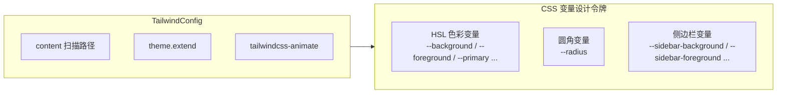
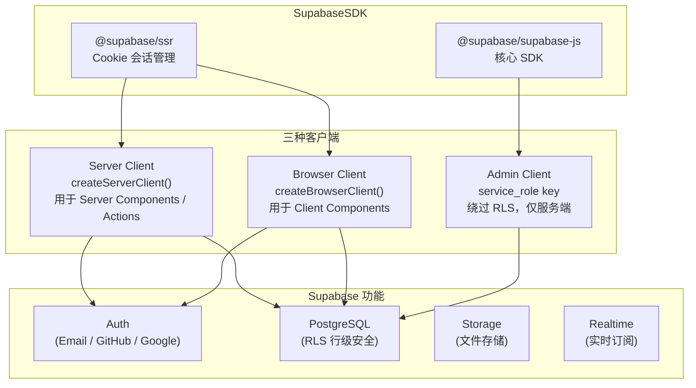
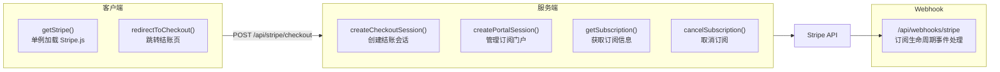

# 技术栈详解

## 核心框架

### Next.js 15 (App Router)

项目基于 Next.js 15 的 App Router 架构，充分利用以下特性：

- **Server Components** — 默认服务端渲染，减少客户端 JS 体积
- **Server Actions** — 直接在组件中调用服务端函数，无需手写 API
- **Route Handlers** — `app/api/` 下的 RESTful API 路由
- **Edge Middleware** — 请求级中间件，处理认证和路由保护
- **Streaming SSR** — 通过 `loading.tsx` 实现流式渲染
- **Metadata API** — 自动生成 SEO 元数据和 OpenGraph 图片
- **standalone 输出** — `output: "standalone"` 适配 Docker 部署

### React 19

- 并发渲染特性
- `use()` Hook 支持
- 改进的 Server Components 支持

## UI 层

### Tailwind CSS 3

- **Dark Mode** — `darkMode: ["class"]`，通过 class 切换
- **设计令牌** — 全部使用 CSS HSL 变量，支持主题切换
- **侧边栏主题** — 独立的 sidebar 色彩变量集
- **动画** — `tailwindcss-animate` 插件提供手风琴等动画

### shadcn/ui 组件库

基于 Radix UI 原语构建的组件系统，当前包含 30 个组件：

| 分类 | 组件 |
|------|------|
| 表单 | button, input, textarea, label, checkbox, radio-group, select, switch, toggle |
| 反馈 | alert, toast, toaster, progress, skeleton, tooltip |
| 布局 | card, separator, tabs, scroll-area, sheet, collapsible |
| 导航 | command, dropdown-menu, popover, context-menu, breadcrumb |
| 数据展示 | table, avatar, badge, kbd |
| 对话框 | dialog, sheet |

### Lucide React

图标系统使用 `lucide-react`，提供一致的 SVG 图标。

## 数据层

### Supabase

三种客户端各有适用场景：

| 客户端 | 密钥 | RLS | 使用场景 |
|--------|------|-----|----------|
| Server Client | anon key | 是 | Server Components, Server Actions, API Routes |
| Browser Client | anon key | 是 | Client Components 中的数据操作 |
| Admin Client | service_role key | 否 | Webhook 处理、后台管理任务 |

### PostgreSQL

- 版本 15（Supabase 托管）
- RLS（行级安全）策略保护所有表
- 自动触发器：新用户创建 profile 和个人 team
- `updated_at` 字段自动更新触发器

## 认证与支付

### Supabase Auth

- **认证方式** — Email/Password、GitHub OAuth、Google OAuth
- **会话管理** — 基于 Cookie 的 SSR 兼容方案
- **回调处理** — `/api/auth/callback` 处理 OAuth 回调
- **密码重置** — forgot-password / reset-password 流程

### Stripe

订阅层级：

| 层级 | 价格 | 特性 |
|------|------|------|
| Free | $0 | 3 个项目、基础分析、社区支持、1GB 存储 |
| Pro | $29/月 | 无限项目、高级分析、优先支持、50GB 存储、5 人团队、API 访问 |
| Enterprise | $99/月 | Pro 全部 + 无限成员、专属支持、500GB 存储、自定义集成、SLA、SSO |

## 国际化

### next-intl 4

- **策略** — `localePrefix: "never"`，语言存储在 Cookie 中，URL 无前缀
- **消息文件** — `messages/{locale}/{namespace}.json`，按命名空间拆分
- **支持语言** — 简体中文（zh-CN）、English（en）
- **命名空间** — 17 个命名空间（common, nav, footer, home, features, pricing, about, faq, changelog, contact, blog, privacy, terms, auth, dashboard, admin, errors）

## 监控与可观测性

### Sentry

- 服务端：`sentry/server.config.ts`
- 边缘端：`sentry/edge.config.ts`
- 客户端：`sentry/client.config.ts`
- 通过 `instrumentation.ts` 自动初始化
- 支持 Sourcemaps 上传

### Appark APM（规划中）

> 状态：**未接线**。模块已移除，未接入任何页面或初始化入口，如需启用见
> [第三方集成](./11-integrations.md#appark-apm-性能监控规划中)。

### 结构化日志

- 分级日志：debug / info / warn / error
- 性能计时器
- 生产环境 error 自动上报 Sentry

## 开发工具

| 工具 | 用途 |
|------|------|
| pnpm | 包管理（workspace 模式） |
| ESLint 9 | 代码规范（eslint-config-next） |
| Prettier | 代码格式化（含 tailwindcss 插件） |
| Husky + lint-staged | Git 提交前钩子 |
| commitlint | 提交消息规范 |
| Vitest 4 | 单元测试 |
| @faker-js/faker | Mock 数据生成 |
| TypeScript 5.7 | 类型检查（strict 模式） |

## 安全特性

| 特性 | 实现 |
|------|------|
| 速率限制 | 内存滑窗算法（IP 级，100 次/分钟） |
| 输入验证 | Zod schema 验证（auth, profile, settings, team） |
| 安全 Headers | X-Frame-Options, X-Content-Type-Options, Referrer-Policy, X-XSS-Protection |
| RLS 策略 | PostgreSQL 行级安全，用户只能操作自己的数据 |
| 环境变量隔离 | service_role key 仅服务端使用 |
| 服务器操作大小限制 | bodySizeLimit: 2mb |
