# 目录结构说明

## 完整目录树

```
Project/
├── src/                          # 源代码
│   ├── app/                      # Next.js App Router
│   │   ├── (marketing)/          # 营销页面路由组
│   │   │   ├── about/            # 关于页面
│   │   │   ├── blog/             # 博客列表 + 详情页
│   │   │   ├── changelog/        # 更新日志
│   │   │   ├── contact/          # 联系页面
│   │   │   ├── faq/              # 常见问题
│   │   │   ├── features/         # 功能介绍
│   │   │   ├── pricing/          # 定价页面
│   │   │   ├── privacy/          # 隐私政策
│   │   │   ├── terms/            # 服务条款
│   │   │   ├── layout.tsx        # 营销页共享布局
│   │   │   └── page.tsx          # 首页（根路由）
│   │   ├── api/                  # API Route Handlers
│   │   │   ├── analytics/        # 分析数据接口
│   │   │   ├── auth/callback/    # Supabase OAuth 回调
│   │   │   ├── health/           # 健康检查
│   │   │   ├── invitations/      # 团队邀请管理
│   │   │   ├── teams/            # 团队 CRUD
│   │   │   ├── user/             # 用户信息
│   │   │   └── webhooks/stripe/  # Stripe Webhook
│   │   ├── auth/                 # 认证页面
│   │   │   ├── callback/         # 认证回调页
│   │   │   ├── forgot-password/  # 忘记密码
│   │   │   ├── login/            # 登录
│   │   │   ├── register/         # 注册
│   │   │   └── reset-password/   # 重置密码
│   │   ├── dashboard/            # 仪表盘（需认证）
│   │   │   ├── admin/            # 管理后台（需 admin 角色）
│   │   │   │   ├── audit-logs/   # 审计日志
│   │   │   │   ├── users/        # 用户管理
│   │   │   │   ├── layout.tsx    # Admin 布局
│   │   │   │   └── page.tsx      # Admin 首页
│   │   │   ├── analytics/        # 数据分析
│   │   │   ├── api-keys/         # API 密钥管理
│   │   │   ├── billing/          # 账单与订阅
│   │   │   ├── integrations/     # 集成管理
│   │   │   ├── notifications/    # 通知设置
│   │   │   ├── profile/          # 个人资料
│   │   │   │   └── edit/         # 资料编辑
│   │   │   ├── projects/         # 项目管理
│   │   │   │   └── [id]/         # 项目详情
│   │   │   ├── settings/         # 系统设置
│   │   │   ├── team/             # 团队管理
│   │   │   │   ├── create/       # 创建团队
│   │   │   │   └── invite/       # 邀请成员
│   │   │   ├── error.tsx         # 仪表盘错误边界
│   │   │   ├── layout.tsx        # 仪表盘布局（含侧边栏）
│   │   │   ├── loading.tsx       # 加载状态
│   │   │   └── page.tsx          # 仪表盘首页
│   │   ├── globals.css           # 全局样式 + CSS 变量
│   │   ├── layout.tsx            # 根布局
│   │   ├── not-found.tsx         # 404 页面
│   │   ├── opengraph-image.tsx   # 动态 OG 图片生成
│   │   ├── providers.tsx         # 全局 Providers
│   │   ├── robots.ts             # robots.txt 生成
│   │   └── sitemap.ts            # sitemap.xml 生成
│   ├── components/               # React 组件
│   │   ├── auth/                 # 认证表单组件
│   │   ├── charts/               # 图表组件
│   │   ├── dashboard/            # 仪表盘专用组件
│   │   ├── data-tables/          # 数据表格
│   │   ├── forms/                # 表单组件
│   │   ├── layout/               # 布局组件（Header/Footer/Sidebar/Theme/Locale）
│   │   ├── providers/            # Context Providers
│   │   ├── shared/               # 通用共享组件
│   │   └── ui/                   # shadcn/ui 基础组件（30 个）
│   ├── hooks/                    # 自定义 Hooks
│   │   ├── use-copy-to-clipboard.ts
│   │   ├── use-debounce.ts
│   │   ├── use-local-storage.ts
│   │   ├── use-media-query.ts
│   │   ├── use-on-click-outside.ts
│   │   ├── use-toast.ts
│   │   └── use-user.ts
│   ├── i18n/                     # 国际化配置
│   │   ├── navigation.ts         # next-intl 导航 API
│   │   ├── request.ts            # 服务端请求配置
│   │   └── routing.ts            # 路由与语言定义
│   ├── lib/                      # 核心库
│   │   ├── actions/              # Server Actions
│   │   │   ├── profile.ts        # 资料操作
│   │   │   ├── settings.ts       # 设置操作
│   │   │   └── team.ts           # 团队操作
│   │   ├── auth/                 # 认证与权限
│   │   │   ├── guards.ts         # 路由守卫
│   │   │   ├── permissions.ts    # 权限定义
│   │   │   └── roles.ts          # 角色定义
│   │   ├── mock/                 # Mock 系统
│   │   │   ├── data.ts           # Mock 数据生成
│   │   │   └── index.ts          # Mock 客户端
│   │   ├── storage/              # 文件存储
│   │   │   └── oss.ts            # 阿里云 OSS
│   │   ├── stripe/               # Stripe 集成
│   │   │   └── index.ts
│   │   ├── supabase/             # Supabase 客户端
│   │   │   ├── admin.ts          # 管理端客户端
│   │   │   ├── client.ts         # 浏览器客户端
│   │   │   ├── database.types.ts # 数据库类型定义
│   │   │   ├── middleware.ts     # 中间件会话管理
│   │   │   └── server.ts         # 服务端客户端
│   │   ├── validations/          # Zod 验证 Schema
│   │   │   ├── auth.ts
│   │   │   ├── profile.ts
│   │   │   ├── settings.ts
│   │   │   └── team.ts
│   │   ├── constants.ts          # 全局常量
│   │   ├── csv.ts                # CSV 工具
│   │   ├── date.ts               # 日期工具
│   │   ├── logger.ts             # 结构化日志
│   │   ├── rate-limit.ts         # 速率限制
│   │   ├── upload.ts             # 文件上传
│   │   └── utils.ts              # 通用工具函数
│   ├── middleware.ts             # Edge Middleware
│   └── instrumentation.ts       # Sentry 初始化
├── messages/                     # i18n 消息文件
│   ├── en/                       # 英文（17 个命名空间）
│   └── zh-CN/                    # 简体中文（17 个命名空间）
├── public/                       # 静态资源
├── supabase/                     # Supabase 本地开发
│   ├── config.toml               # Supabase CLI 配置
│   ├── migrations/               # 数据库迁移
│   │   └── 001_initial_schema.sql
│   └── seed.sql                  # 种子数据
├── scripts/                      # 开发脚本
│   ├── dev.sh                    # 本地开发启动脚本
│   └── setup.sh                  # 项目初始化脚本
├── sentry/                       # Sentry 配置
│   ├── client.config.ts
│   ├── edge.config.ts
│   └── server.config.ts
├── docs-site/                    # VitePress 文档站
│   ├── .vitepress/               # VitePress 配置
│   ├── en/                       # 英文文档
│   ├── zh-CN/                    # 中文文档
│   ├── Dockerfile                # 文档站 Docker 构建
│   └── nginx.conf                # Nginx 配置
├── docs/architecture/            # 架构文档（本目录）
├── agents/                       # AI Agent 定义
├── .github/                      # GitHub 配置
├── .husky/                       # Git Hooks
├── .vscode/                      # VS Code 配置
├── package.json
├── tsconfig.json
├── tailwind.config.ts
├── next.config.ts
├── eslint.config.mjs
├── vitest.config.ts
├── Dockerfile                    # 应用 Docker 构建
├── docker-compose.yml            # 本地开发环境
├── .env.example                  # 环境变量模板
└── pnpm-workspace.yaml           # pnpm 工作空间配置
```

## 关键路径别名

```json
{
  "paths": {
    "@/*": ["./src/*"]
  }
}
```

所有内部模块引用均使用 `@/` 前缀，如 `@/lib/supabase/server`、`@/components/ui/button`。

## 文件职责矩阵

```mermaid
graph LR
    subgraph AppRouter["app/ 目录职责"]
        Pages["page.tsx<br/>页面组件"]
        Layouts["layout.tsx<br/>共享布局"]
        Loading["loading.tsx<br/>加载状态"]
        Error["error.tsx<br/>错误边界"]
        Routes["route.ts<br/>API 路由"]
    end
    subgraph Components["components/ 目录职责"]
        UI["ui/<br/>基础 UI 组件"]
        Shared["shared/<br/>通用业务组件"]
        Layout["layout/<br/>布局组件"]
        Forms["forms/<br/>表单组件"]
        Dashboard["dashboard/<br/>仪表盘专用"]
    end
    subgraph Lib["lib/ 目录职责"]
        Actions["actions/<br/>Server Actions"]
        Auth["auth/<br/>认证权限"]
        Supabase["supabase/<br/>数据库客户端"]
        Validations["validations/<br/>输入验证"]
        Utils["工具函数"]
    end

    AppRouter --> Components
    AppRouter --> Lib
    Components --> Lib
```



## 命名规范

| 类型 | 规范 | 示例 |
|------|------|------|
| 页面文件 | `page.tsx` | `app/dashboard/page.tsx` |
| 布局文件 | `layout.tsx` | `app/dashboard/layout.tsx` |
| API 路由 | `route.ts` | `app/api/teams/route.ts` |
| 加载状态 | `loading.tsx` | `app/dashboard/loading.tsx` |
| 错误边界 | `error.tsx` | `app/dashboard/error.tsx` |
| 未找到 | `not-found.tsx` | `app/not-found.tsx` |
| Server Actions | `*.ts`（含 `"use server"`） | `lib/actions/team.ts` |
| 客户端组件 | `"use client"` 声明 | `components/providers/theme-provider.tsx` |
| 验证 Schema | `*.ts`（Zod） | `lib/validations/auth.ts` |
| 测试文件 | `*.test.ts` | `lib/utils.test.ts` |
| i18n 消息 | `{namespace}.json` | `messages/zh-CN/dashboard.json` |
