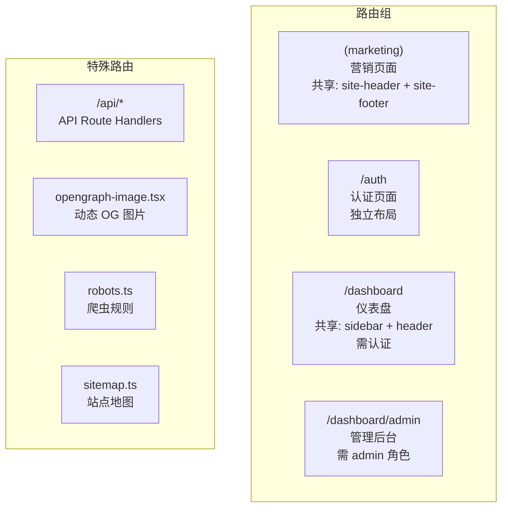
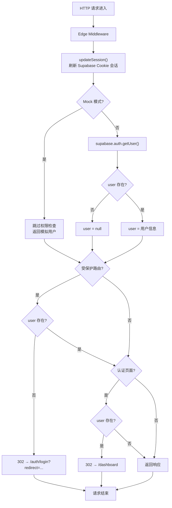
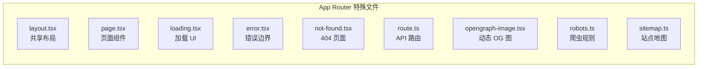

# 路由体系

## 路由总览

项目使用 Next.js App Router 文件系统路由，结合路由组（Route Groups）实现布局隔离。



## 路由保护机制



### 受保护路由

```typescript
// src/middleware.ts
const protectedRoutes = ["/dashboard", "/dashboard/(.*)"];
const authRoutes = ["/auth/login", "/auth/register"];
```

- **受保护路由** — `/dashboard` 及其所有子路由，未登录用户重定向到登录页
- **认证路由** — `/auth/login`、`/auth/register`，已登录用户重定向到仪表盘
- **细粒度角色检查** — 由页面组件内的 `requireRole()` / `requirePermission()` 处理

### Matcher 配置

```typescript
export const config = {
  matcher: [
    "/((?!_next/static|_next/image|favicon.ico|.*\\.(?:svg|png|jpg|jpeg|gif|webp)$).*)",
  ],
};
```

排除静态资源、图片和 favicon，其余所有路径都经过中间件。

## 路由清单

### 营销页面 `(marketing)`

| 路由 | 文件 | 说明 |
|------|------|------|
| `/ | `app/(marketing)/page.tsx` | 首页 |
| `/features` | `app/(marketing)/features/page.tsx` | 功能介绍 |
| `/pricing` | `app/(marketing)/pricing/page.tsx` | 定价方案 |
| `/about` | `app/(marketing)/about/page.tsx` | 关于我们 |
| `/blog` | `app/(marketing)/blog/page.tsx` | 博客列表 |
| `/blog/[slug]` | `app/(marketing)/blog/[slug]/page.tsx` | 博客详情 |
| `/changelog` | `app/(marketing)/changelog/page.tsx` | 更新日志 |
| `/faq` | `app/(marketing)/faq/page.tsx` | 常见问题 |
| `/contact` | `app/(marketing)/contact/page.tsx` | 联系我们 |
| `/privacy` | `app/(marketing)/privacy/page.tsx` | 隐私政策 |
| `/terms` | `app/(marketing)/terms/page.tsx` | 服务条款 |

### 认证页面 `/auth`

| 路由 | 文件 | 说明 |
|------|------|------|
| `/auth/login` | `app/auth/login/page.tsx` | 登录 |
| `/auth/register` | `app/auth/register/page.tsx` | 注册 |
| `/auth/forgot-password` | `app/auth/forgot-password/page.tsx` | 忘记密码 |
| `/auth/reset-password` | `app/auth/reset-password/page.tsx` | 重置密码 |
| `/auth/callback` | `app/auth/callback/page.tsx` | 认证回调 |

### 仪表盘 `/dashboard`

| 路由 | 文件 | 权限 | 说明 |
|------|------|------|------|
| `/dashboard` | `app/dashboard/page.tsx` | 已登录 | 仪表盘首页 |
| `/dashboard/analytics` | `app/dashboard/analytics/page.tsx` | analytics:read | 数据分析 |
| `/dashboard/profile` | `app/dashboard/profile/page.tsx` | 已登录 | 个人资料 |
| `/dashboard/profile/edit` | `app/dashboard/profile/edit/page.tsx` | 已登录 | 资料编辑 |
| `/dashboard/settings` | `app/dashboard/settings/page.tsx` | settings:read | 系统设置 |
| `/dashboard/team` | `app/dashboard/team/page.tsx` | team:read | 团队管理 |
| `/dashboard/team/create` | `app/dashboard/team/create/page.tsx` | team:write | 创建团队 |
| `/dashboard/team/invite` | `app/dashboard/team/invite/page.tsx` | team:invite | 邀请成员 |
| `/dashboard/projects` | `app/dashboard/projects/page.tsx` | project:read | 项目列表 |
| `/dashboard/projects/[id]` | `app/dashboard/projects/[id]/page.tsx` | project:read | 项目详情 |
| `/dashboard/billing` | `app/dashboard/billing/page.tsx` | billing:read | 账单管理 |
| `/dashboard/notifications` | `app/dashboard/notifications/page.tsx` | notification:read | 通知设置 |
| `/dashboard/integrations` | `app/dashboard/integrations/page.tsx` | integration:read | 集成管理 |
| `/dashboard/api-keys` | `app/dashboard/api-keys/page.tsx` | 已登录 | API 密钥 |

### 管理后台 `/dashboard/admin`

| 路由 | 文件 | 权限 | 说明 |
|------|------|------|------|
| `/dashboard/admin` | `app/dashboard/admin/page.tsx` | admin 角色 | 管理首页 |
| `/dashboard/admin/users` | `app/dashboard/admin/users/page.tsx` | user:manage | 用户管理 |
| `/dashboard/admin/audit-logs` | `app/dashboard/admin/audit-logs/page.tsx` | audit:read | 审计日志 |

### API 路由 `/api`

| 路由 | 方法 | 权限 | 说明 |
|------|------|------|------|
| `/api/health` | GET | 无 | 健康检查 |
| `/api/user` | GET | 已登录 | 获取当前用户 |
| `/api/teams` | GET/POST/PATCH/DELETE | team:read/write | 团队 CRUD |
| `/api/invitations` | GET/POST/DELETE | team:read/invite | 团队邀请管理 |
| `/api/analytics` | GET | analytics:read | 分析数据 |
| `/api/auth/callback` | GET | 无 | OAuth 回调 |
| `/api/webhooks/stripe` | POST | 无（Webhook 签名验证） | Stripe 事件处理 |

## 特殊文件



| 文件 | 位置 | 作用 |
|------|------|------|
| `layout.tsx` | `app/layout.tsx`, `app/(marketing)/layout.tsx`, `app/dashboard/layout.tsx`, `app/dashboard/admin/layout.tsx` | 共享布局组件 |
| `loading.tsx` | `app/dashboard/loading.tsx`, `app/dashboard/admin/loading.tsx` | 流式渲染加载状态 |
| `error.tsx` | `app/error.tsx`, `app/dashboard/error.tsx` | 错误边界 |
| `not-found.tsx` | `app/not-found.tsx` | 404 页面 |
| `opengraph-image.tsx` | `app/opengraph-image.tsx` | 动态生成社交分享图 |
| `robots.ts` | `app/robots.ts` | 生成 robots.txt |
| `sitemap.ts` | `app/sitemap.ts` | 生成 sitemap.xml |

## 重定向规则

```typescript
// next.config.ts
async redirects() {
  return [
    { source: "/home", destination: "/", permanent: true },
    { source: "/docs/:path*", destination: "${DOCS_URL}/:path*", permanent: false },
  ];
}
```

## 安全 Headers

```typescript
// next.config.ts
headers: [
  { source: "/(.*)", headers: [
    { key: "X-Frame-Options", value: "DENY" },
    { key: "X-Content-Type-Options", value: "nosniff" },
    { key: "Referrer-Policy", value: "strict-origin-when-cross-origin" },
    { key: "X-XSS-Protection", value: "1; mode=block" },
  ]},
  { source: "/static/(.*)", headers: [
    { key: "Cache-Control", value: "public, max-age=31536000, immutable" },
  ]},
]
```
