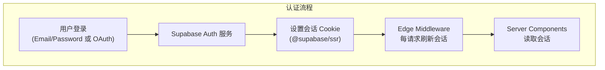
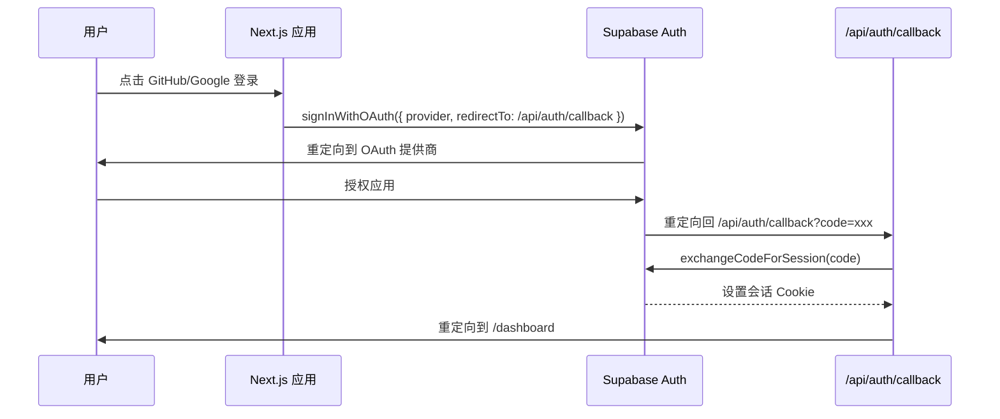
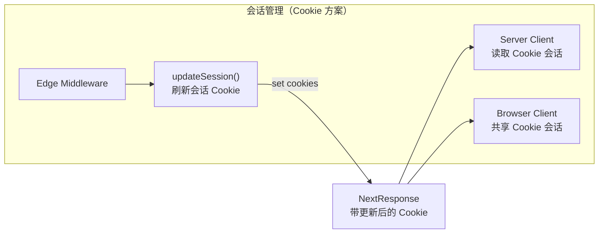
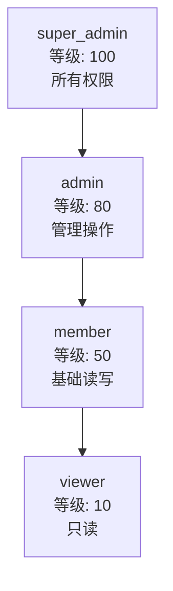
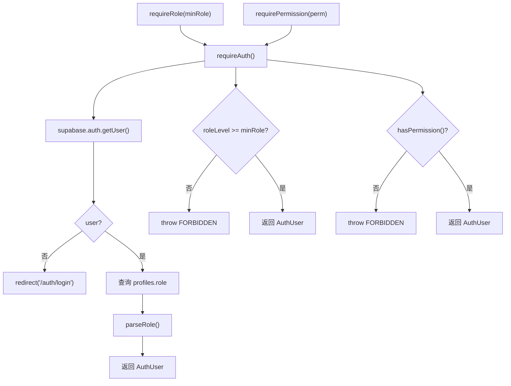

# 认证与 RBAC 权限系统

## 认证架构



### 认证方式

| 方式 | 状态 | 配置 |
|------|------|------|
| Email/Password | 已启用 | Supabase Auth 内置 |
| GitHub OAuth | 已启用 | `auth.external.github` |
| Google OAuth | 已启用 | `auth.external.google` |
| WeChat | 可选 | 配置中预留 |
| Apple | 可选 | 配置中预留 |

### OAuth 回调流程



### 会话管理



三种 Supabase 客户端的会话处理：

| 客户端 | 会话来源 | 用途 |
|--------|----------|------|
| Middleware Client | `request.cookies` | Edge 中间件会话刷新 |
| Server Client | `cookies()` | Server Components / Actions |
| Browser Client | 浏览器 Cookie | Client Components |

## RBAC 权限系统

### 角色层级



### 权限矩阵

```mermaid
graph LR
    subgraph Domains["权限域"]
        User["user:read/write/delete/manage"]
        Team["team:read/write/delete/invite/remove"]
        Project["project:read/write/delete/manage"]
        Billing["billing:read/write/manage"]
        Settings["settings:read/write"]
        Analytics["analytics:read/export"]
        Integration["integration:read/write"]
        Notification["notification:read/write"]
        System["system:read/write/manage"]
        Audit["audit:read/export"]
    end
```



| 权限 | viewer | member | admin | super_admin |
|------|:------:|:------:|:-----:|:-----------:|
| user:read | yes | yes | yes | yes |
| user:write | - | yes | yes | yes |
| user:manage | - | - | yes | yes |
| user:delete | - | - | - | yes |
| team:read | yes | yes | yes | yes |
| team:write | - | - | yes | yes |
| team:invite | - | - | yes | yes |
| team:remove | - | - | yes | yes |
| team:delete | - | - | - | yes |
| project:read | yes | yes | yes | yes |
| project:write | - | yes | yes | yes |
| project:manage | - | - | yes | yes |
| project:delete | - | - | yes | yes |
| billing:read | - | yes | yes | yes |
| billing:write | - | - | yes | yes |
| billing:manage | - | - | yes | yes |
| settings:read | yes | yes | yes | yes |
| settings:write | - | yes | yes | yes |
| analytics:read | yes | yes | yes | yes |
| analytics:export | - | - | yes | yes |
| integration:read | - | yes | yes | yes |
| integration:write | - | - | yes | yes |
| notification:read | yes | yes | yes | yes |
| notification:write | - | yes | yes | yes |
| system:read | - | - | - | yes |
| system:write | - | - | - | yes |
| system:manage | - | - | - | yes |
| audit:read | - | - | - | yes |
| audit:export | - | - | - | yes |

### 权限命名规范

```
<domain>:<action>
```

支持的 action：`read` / `write` / `create` / `delete` / `manage` / `invite` / `remove` / `export`

### 团队角色

| 团队角色 | 映射到系统角色 | 说明 |
|----------|---------------|------|
| owner | admin | 团队创建者 |
| admin | admin | 团队管理员 |
| member | member | 普通成员 |

## 守卫函数

### Server Component 守卫（抛异常 / 重定向）



| 函数 | 用途 | 失败行为 |
|------|------|----------|
| `requireAuth()` | 获取当前用户 | 重定向到登录页 |
| `requireRole(minRole)` | 要求最低角色 | 抛出 FORBIDDEN |
| `requirePermission(perm)` | 要求具体权限 | 抛出 FORBIDDEN |

### API Route 守卫（返回 Result 类型）

| 函数 | 用途 | 失败行为 |
|------|------|----------|
| `safelyRequireAuth()` | 获取当前用户 | 返回 `{ success: false, error }` |
| `safelyRequireRole(minRole)` | 要求最低角色 | 返回 `{ success: false, error }` |
| `safelyRequirePermission(perm)` | 要求具体权限 | 返回 `{ success: false, error }` |

### 错误类型

```typescript
class AuthGuardError extends Error {
  code: "UNAUTHORIZED" | "FORBIDDEN" | "NOT_FOUND"
}
```

| 错误码 | 含义 | HTTP 状态码 |
|--------|------|-------------|
| UNAUTHORIZED | 未登录 | 401 |
| FORBIDDEN | 权限不足 | 403 |
| NOT_FOUND | 资源不存在 | 404 |

## 权限使用示例

```typescript
// Server Component
import { requireRole, requirePermission } from "@/lib/auth/guards"

// 要求 admin 角色
const user = await requireRole("admin")

// 要求 team:invite 权限
const user = await requirePermission(PERMISSIONS.team.invite)
```

```typescript
// API Route
import { safelyRequireAuth } from "@/lib/auth/guards"

const result = await safelyRequireAuth()
if (!result.success) {
  return NextResponse.json({ error: result.error.message }, { status: 401 })
}
const user = result.data
```

```typescript
// 组件级权限控制
import { PermissionGate } from "@/components/shared/permission-gate"

<PermissionGate permission={PERMISSIONS.team.invite}>
  <InviteButton />
</PermissionGate>
```
