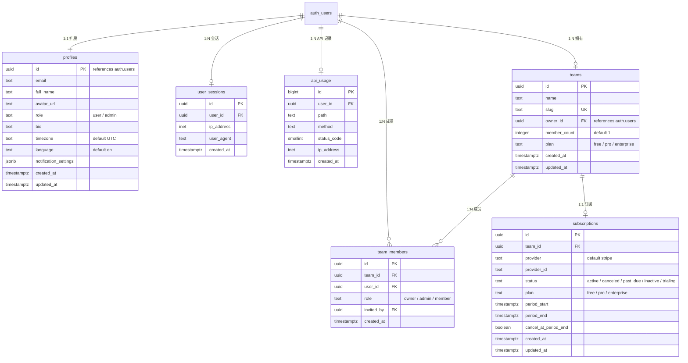
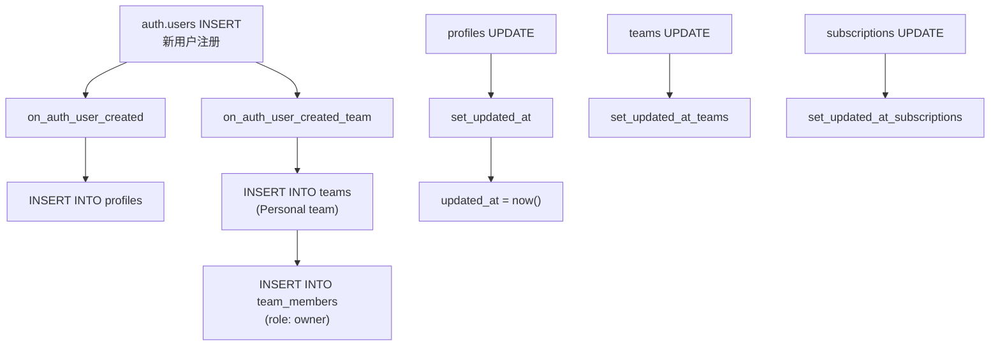
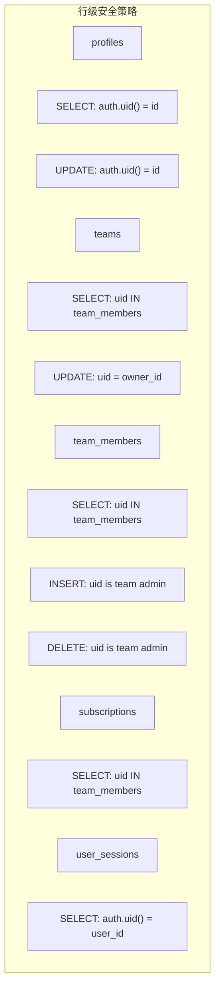

# 数据库设计

## 数据库架构

项目使用 Supabase 托管的 PostgreSQL 15 数据库，通过 RLS（行级安全）策略保护数据访问。



## 表结构详解

### profiles

用户资料表，扩展 `auth.users`。新用户注册时通过触发器自动创建。

| 字段 | 类型 | 默认值 | 说明 |
|------|------|--------|------|
| id | uuid (PK) | — | 引用 `auth.users.id`，级联删除 |
| email | text | — | 用户邮箱 |
| full_name | text | — | 全名 |
| avatar_url | text | — | 头像 URL（OSS） |
| role | text | 'user' | 系统角色（user / admin） |
| bio | text | — | 个人简介 |
| timezone | text | 'UTC' | 时区 |
| language | text | 'en' | 语言偏好 |
| notification_settings | jsonb | 默认 JSON | 通知偏好 |
| created_at | timestamptz | now() | 创建时间 |
| updated_at | timestamptz | now() | 更新时间（自动触发） |

**RLS 策略：**
- 用户只能查看自己的 profile（`auth.uid() = id`）
- 团队成员可查看同团队成员的 profile（协作场景：团队页 / 邀请列表需显示成员邮箱、姓名、头像）
- 用户只能更新自己的 profile（`auth.uid() = id`）

**触发器：**
- `on_auth_user_created` — 新用户注册后自动创建 profile
- `set_updated_at` — 更新时自动设置 `updated_at`

### teams

团队表。每个用户注册时自动创建一个 Personal 团队。

| 字段 | 类型 | 默认值 | 说明 |
|------|------|--------|------|
| id | uuid (PK) | gen_random_uuid() | 团队 ID |
| name | text | — | 团队名称 |
| slug | text (UK) | — | URL 友好标识 |
| owner_id | uuid (FK) | — | 所有者，引用 auth.users |
| member_count | integer | 1 | 成员数量 |
| plan | text | 'free' | 订阅计划 |
| created_at | timestamptz | now() | — |
| updated_at | timestamptz | now() | 自动更新 |

**RLS 策略：**
- 团队成员可查看（`auth.uid() IN team_members`）
- 仅所有者可更新（`auth.uid() = owner_id`）

### team_members

团队成员关联表。

| 字段 | 类型 | 说明 |
|------|------|------|
| id | uuid (PK) | — |
| team_id | uuid (FK) | 引用 teams，级联删除 |
| user_id | uuid (FK) | 引用 auth.users，级联删除 |
| role | text | owner / admin / member |
| invited_by | uuid (FK) | 邀请人，引用 auth.users |
| created_at | timestamptz | — |
| | | UNIQUE(team_id, user_id) |

**RLS 策略：**
- 团队成员可查看成员列表
- 团队管理员（owner/admin）可邀请新成员
- 团队管理员可移除成员

**触发器：**
- `on_auth_user_created_team` — 新用户注册后自动创建 Personal 团队并加入为 owner

### subscriptions

订阅/账单表，记录 Stripe 订阅状态。

| 字段 | 类型 | 说明 |
|------|------|------|
| id | uuid (PK) | — |
| team_id | uuid (FK) | 引用 teams，级联删除 |
| provider | text | 支付提供商（默认 stripe） |
| provider_id | text | Stripe 订阅 ID |
| status | text | active / canceled / past_due / inactive / trialing |
| plan | text | free / pro / enterprise |
| period_start | timestamptz | 订阅周期开始 |
| period_end | timestamptz | 订阅周期结束 |
| cancel_at_period_end | boolean | 是否在周期结束时取消 |
| created_at | timestamptz | — |
| updated_at | timestamptz | 自动更新 |

### user_sessions

用户会话追踪表。

### api_usage

API 使用量追踪表，用于速率限制和分析。

| 索引 | 字段 |
|------|------|
| idx_api_usage_user_id | user_id |
| idx_api_usage_created_at | created_at |

## 自动触发器



## RLS 安全策略



## TypeScript 类型

数据库类型由 Supabase CLI 自动生成：

```bash
pnpm db:types
# supabase gen types typescript --local > src/lib/supabase/database.types.ts
```

类型定义位于 `src/lib/supabase/database.types.ts`，为每个表提供 `Row`、`Insert`、`Update` 三种类型。

```typescript
export interface Database {
  public: {
    Tables: {
      profiles: {
        Row: { ... }      // 查询结果类型
        Insert: { ... }   // 插入数据类型
        Update: { ... }   // 更新数据类型
        Relationships: [...]
      }
      // ... 其他表
    }
  }
}
```

## 订阅计划


