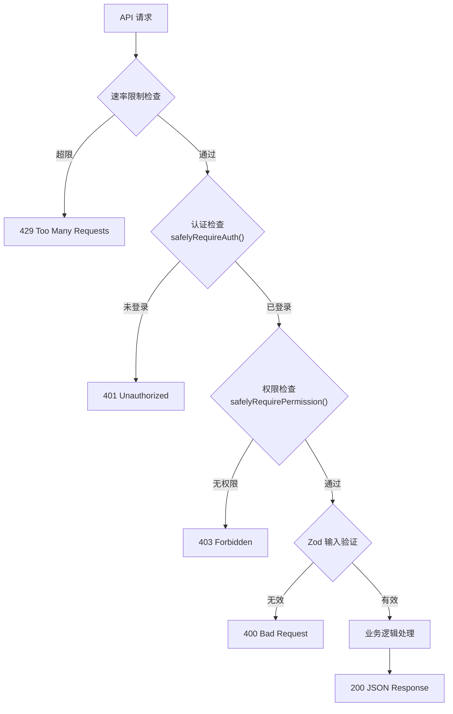
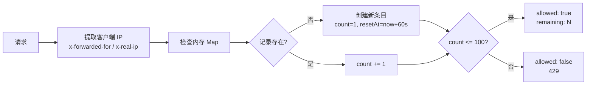
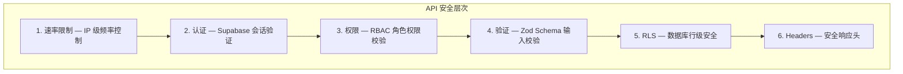

# API 路由设计

## 概述

API 路由位于 `src/app/api/` 目录下，使用 Next.js Route Handlers 实现 RESTful 接口。所有 API 路由遵循统一的安全模式和响应格式。



## API 路由清单

### GET /api/health

健康检查端点，用于负载均衡器和监控系统。

- **认证** — 不需要
- **速率限制** — 不适用
- **响应** — 服务状态、运行时间、依赖检查

```json
{
  "status": "ok",
  "timestamp": "2026-08-02T...",
  "uptime": 3600,
  "environment": "production",
  "checks": {
    "supabase": { "configured": true },
    "sentry": { "configured": true },
    "stripe": { "configured": true }
  }
}
```

### GET /api/user

获取当前登录用户的资料信息。

- **认证** — 需要
- **速率限制** — 100 次/分钟
- **响应** — 用户 ID、邮箱、邮箱验证状态、创建时间、profile 数据

### GET /api/teams

获取当前用户所属的所有团队，或单个团队详情。

- **认证** — 需要
- **权限** — `team:read`
- **查询参数** — `?id=xxx`（可选，获取单个团队）
- **响应** — 团队列表或单个团队详情

### POST /api/teams

创建新团队。

- **认证** — 需要
- **权限** — `team:write`
- **Body** — `{ name: string, slug: string }`
- **验证** — `createTeamSchema` (Zod)
- **响应** — 创建的团队对象

### PATCH /api/teams?id=xxx

更新团队信息。

- **认证** — 需要
- **权限** — `team:write`
- **Body** — `{ name?: string, slug?: string }`
- **验证** — `updateTeamSchema` (Zod)
- **响应** — 更新后的团队对象

### DELETE /api/teams?id=xxx

删除团队（仅所有者）。

- **认证** — 需要
- **权限** — `team:delete`
- **响应** — 204 No Content

### GET /api/invitations?team_id=xxx

获取团队成员列表（含邀请信息）。

- **认证** — 需要
- **权限** — `team:read`
- **响应** — 成员列表

### POST /api/invitations

发送团队邀请。

- **认证** — 需要
- **权限** — `team:invite`
- **Body** — `{ teamId: string, email: string, role: string }`
- **验证** — `inviteMemberSchema` (Zod)
- **响应** — 邀请记录

### DELETE /api/invitations?id=xxx

撤销邀请或移除成员。

- **认证** — 需要
- **权限** — `team:remove`
- **响应** — 204 No Content

### GET /api/analytics

获取分析汇总数据。

- **认证** — 需要
- **权限** — `analytics:read`
- **查询参数** — `?range=7|14|30`（天数，默认 30，最大 90）
- **响应** — 页面浏览量、独立访客、事件指标、趋势图表数据

### GET /api/auth/callback

Supabase OAuth 回调处理。

- **认证** — 不需要
- **流程** — 交换 code 为 session，重定向到 dashboard

### POST /api/webhooks/stripe

Stripe Webhook 事件处理。

- **认证** — 不需要（通过 Stripe 签名验证）
- **处理事件** — `customer.subscription.created`、`customer.subscription.updated`
- **响应** — 200 OK

## 统一响应格式

### 成功响应

```json
{
  "data": { ... },
  // 或直接返回数据
}
```

### 错误响应

```json
{
  "error": "错误消息"
}
```

### 常见状态码

| 状态码 | 含义 | 场景 |
|--------|------|------|
| 200 | OK | 请求成功 |
| 204 | No Content | 删除成功 |
| 400 | Bad Request | 输入验证失败 |
| 401 | Unauthorized | 未登录 |
| 403 | Forbidden | 权限不足 |
| 404 | Not Found | 资源不存在 |
| 429 | Too Many Requests | 速率限制 |
| 500 | Internal Server Error | 服务端错误 |

## 速率限制



- **算法** — 内存滑动窗口
- **限制** — 100 次/分钟（IP 级）
- **清理** — 每 60 秒清理过期条目
- **生产建议** — 替换为 Redis 实现（@upstash/ratelimit 或 Vercel KV）

## 安全模式


