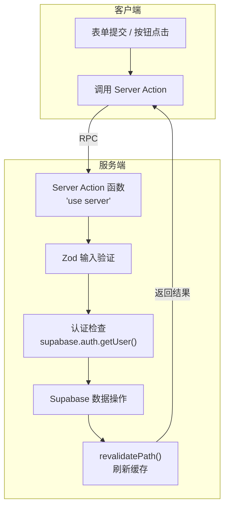
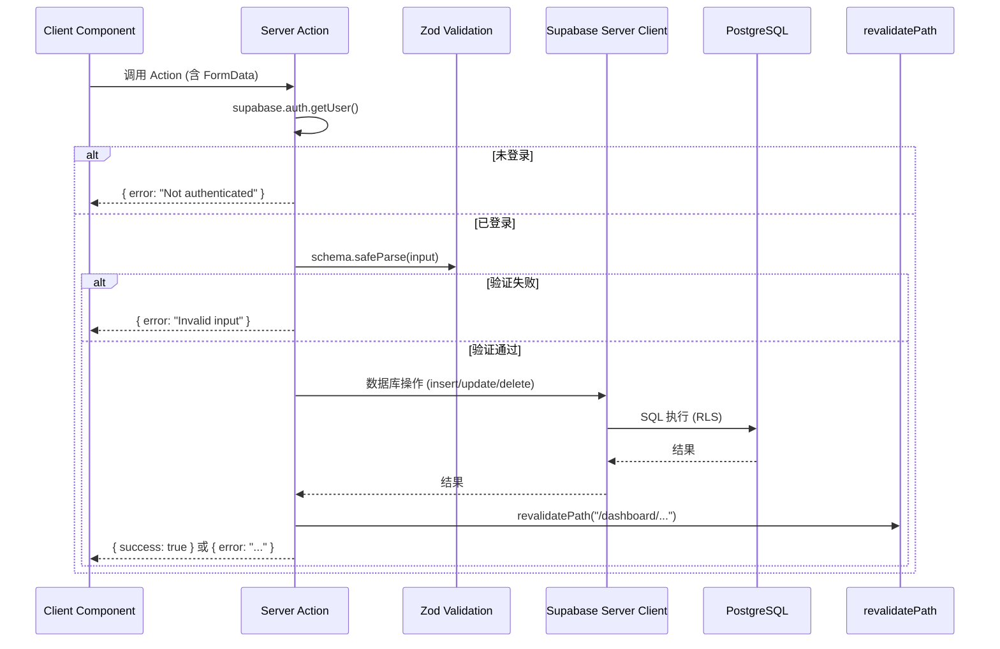
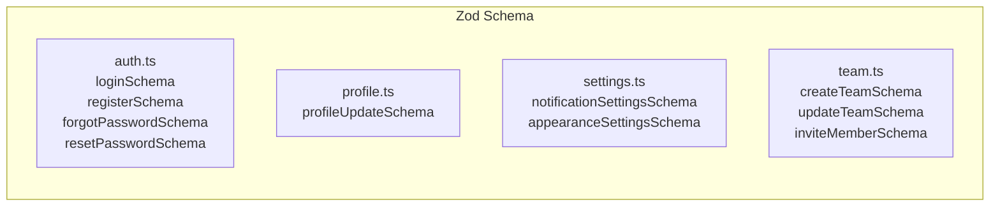

# Server Actions

## 概述

Server Actions 是 Next.js App Router 的服务端函数机制，允许在 Server Components 和 Client Components 中直接调用服务端代码，无需手写 API 端点。



## Actions 清单

### profile.ts — 个人资料操作

| 函数 | 功能 | 输入验证 | 认证 |
|------|------|----------|------|
| `getProfile()` | 获取当前用户资料 | — | supabase.auth.getUser() |
| `updateProfile(input)` | 更新用户资料 | `profileUpdateSchema` | 需要 |

```typescript
// 使用示例
import { updateProfile } from "@/lib/actions/profile"

const result = await updateProfile({
  full_name: "张三",
  bio: "独立开发者"
})
if (result.error) {
  // 处理错误
}
```

### settings.ts — 设置操作

| 函数 | 功能 | 输入验证 | 认证 |
|------|------|----------|------|
| `updateNotificationSettings(formData)` | 更新通知偏好 | `notificationSettingsSchema` | 需要 |
| `updateAppearanceSettings(formData)` | 更新外观设置 | `appearanceSettingsSchema` | 需要 |

通知设置字段：
- emailNotifications — 邮件通知
- marketingEmails — 营销邮件
- productUpdates — 产品更新
- securityAlerts — 安全告警

### team.ts — 团队操作

| 函数 | 功能 | 输入验证 | 认证 |
|------|------|----------|------|
| `getCurrentTeam()` | 获取当前用户团队 | — | 需要 |
| `getTeamMembers(teamId)` | 获取团队成员列表 | — | 需要 |
| `createTeam(input)` | 创建新团队 | `createTeamSchema` | 需要 |
| `inviteMember(input)` | 邀请团队成员 | `inviteMemberSchema` | 需要 |

## 数据流



## 输入验证 Schema



每个 Server Action 都有对应的 Zod Schema 进行输入验证，确保类型安全和数据完整性。

## 返回值模式

Server Actions 统一使用 `{ error?: string }` 或 `{ success: true }` 的返回模式：

```typescript
// 成功
return { success: true }

// 失败
return { error: "错误消息" }
```

客户端组件通过检查 `result.error` 判断操作是否成功，并显示相应的 Toast 通知。

## 缓存刷新

Server Actions 修改数据后通过 `revalidatePath()` 刷新对应路由的缓存：

| Action | revalidatePath |
|--------|---------------|
| updateProfile | /dashboard/profile |
| updateNotificationSettings | /dashboard/settings |
| createTeam | /dashboard/team |
| inviteMember | /dashboard/team |

## 测试覆盖

以下文件包含单元测试：

| 测试文件 | 覆盖模块 |
|----------|----------|
| `lib/validations/auth.test.ts` | 认证 Schema |
| `lib/validations/profile.test.ts` | 资料 Schema |
| `lib/validations/settings.test.ts` | 设置 Schema |
| `lib/validations/team.test.ts` | 团队 Schema |
| `lib/utils.test.ts` | 工具函数 |
| `lib/rate-limit.test.ts` | 速率限制 |
