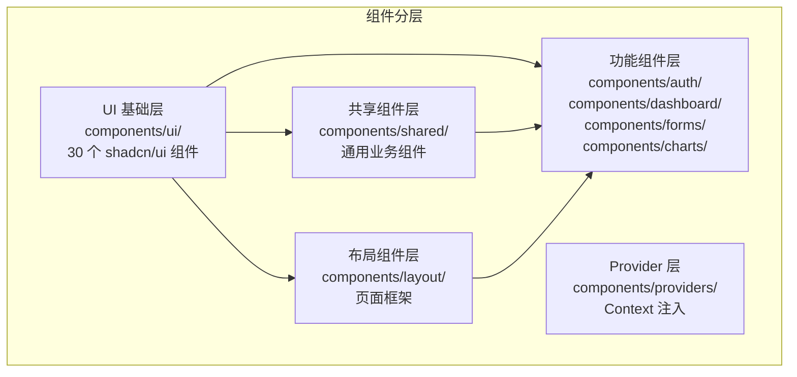
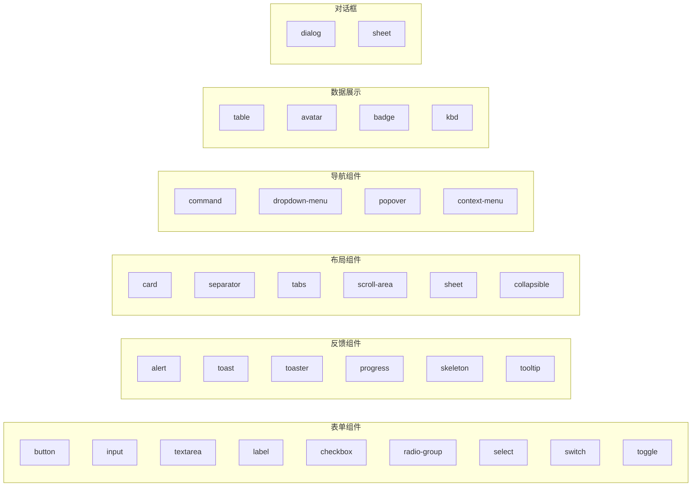
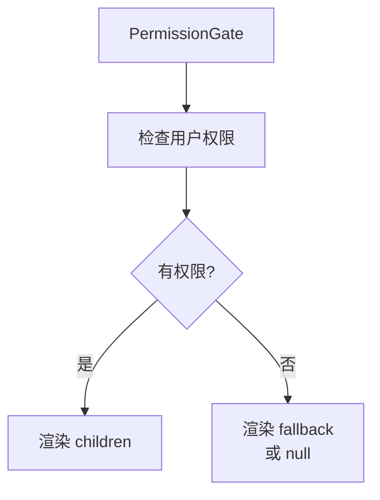
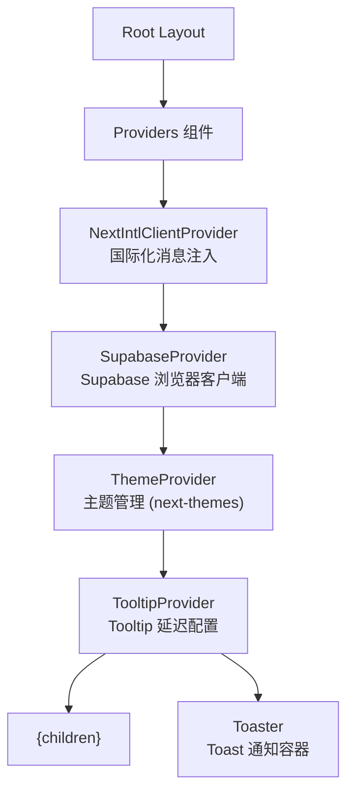
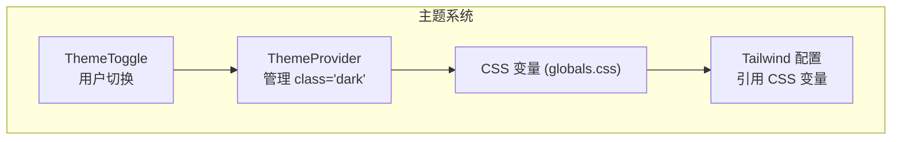

# 前端组件体系

## 组件架构



## UI 基础组件（shadcn/ui）

基于 Radix UI 原语构建，使用 Tailwind CSS 样式，通过 CSS 变量实现主题切换。

### 组件分类



## 共享组件

| 组件 | 文件 | 功能 |
|------|------|------|
| PageContainer | `shared/page-container.tsx` | 页面容器（标题 + 内容） |
| PageHeader | `shared/page-header.tsx` | 页面标题区域 |
| PageLoader | `shared/page-loader.tsx` | 全屏加载状态 |
| Breadcrumbs | `shared/breadcrumbs.tsx` | 面包屑导航 |
| ConfirmDialog | `shared/confirm-dialog.tsx` | 确认对话框 |
| EmptyState | `shared/empty-state.tsx` | 空数据状态 |
| ErrorState | `shared/error-state.tsx` | 错误状态 |
| LoadingState | `shared/loading-state.tsx` | 加载状态 |
| PermissionGate | `shared/permission-gate.tsx` | 权限控制组件 |
| SearchInput | `shared/search-input.tsx` | 搜索输入框 |
| Section | `shared/section.tsx` | 内容分区 |

### PermissionGate 组件



```tsx
<PermissionGate permission={PERMISSIONS.team.invite}>
  <InviteButton />
</PermissionGate>
```

## 布局组件

| 组件 | 文件 | 功能 |
|------|------|------|
| SiteHeader | `layout/site-header.tsx` | 全站顶部导航栏 |
| SiteFooter | `layout/site-footer.tsx` | 全站底部页脚 |
| DashboardSidebar | `dashboard/dashboard-sidebar.tsx` | 仪表盘侧边栏导航 |
| ThemeToggle | `layout/theme-toggle.tsx` | 主题切换（light/dark/system） |
| LocaleSwitcher | `layout/locale-switcher.tsx` | 语言切换器 |

## Provider 组件



| Provider | 包 | 功能 |
|----------|-----|------|
| NextIntlClientProvider | next-intl | 注入 i18n 消息和 locale |
| SupabaseProvider | @supabase/ssr | 提供浏览器端 Supabase 客户端 |
| ThemeProvider | next-themes | 主题管理（light/dark/system） |
| TooltipProvider | @radix-ui/react-tooltip | Tooltip 延迟配置 |
| Toaster | 自定义 | Toast 通知容器 |

## 功能组件

### 认证组件

| 组件 | 功能 |
|------|------|
| LoginForm | 登录表单（Email/Password + OAuth） |
| RegisterForm | 注册表单 |

### 仪表盘组件

| 组件 | 功能 |
|------|------|
| StatsCard | 统计数据卡片 |
| RemoveMemberButton | 移除团队成员按钮（含确认对话框） |

### 表单组件

| 组件 | 功能 |
|------|------|
| ProfileEditForm | 资料编辑表单 |
| PasswordForm | 密码修改表单 |
| NotificationSettingsForm | 通知设置表单 |
| InviteMemberForm | 邀请成员表单 |

### 图表组件

| 组件 | 功能 |
|------|------|
| AreaChart | 面积图（基于 Recharts） |

### 数据表格

| 组件 | 功能 |
|------|------|
| DataTable | 通用数据表格（基于 @tanstack/react-table） |

## 自定义 Hooks

| Hook | 功能 |
|------|------|
| `useCopyToClipboard` | 复制文本到剪贴板 |
| `useDebounce` | 防抖 |
| `useLocalStorage` | localStorage 读写 |
| `useMediaQuery` | 响应式断点检测 |
| `useOnClickOutside` | 点击外部检测 |
| `useToast` | Toast 通知 |
| `useUser` | 当前用户信息 |

## 主题系统



### CSS 变量

| 变量 | 用途 |
|------|------|
| `--background` / `--foreground` | 基础背景/前景色 |
| `--primary` / `--primary-foreground` | 主色调 |
| `--secondary` / `--secondary-foreground` | 次要色 |
| `--destructive` / `--destructive-foreground` | 危险/错误色 |
| `--muted` / `--muted-foreground` | 静默色 |
| `--accent` / `--accent-foreground` | 强调色 |
| `--card` / `--card-foreground` | 卡片色 |
| `--popover` / `--popover-foreground` | 弹窗色 |
| `--border` / `--input` / `--ring` | 边框/输入/焦点环 |
| `--sidebar-*` | 侧边栏专用色 |
| `--radius` | 圆角 |

## 图标系统

使用 `lucide-react` 图标库，在按钮、导航、表单等组件中使用统一的 SVG 图标。
