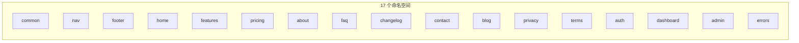
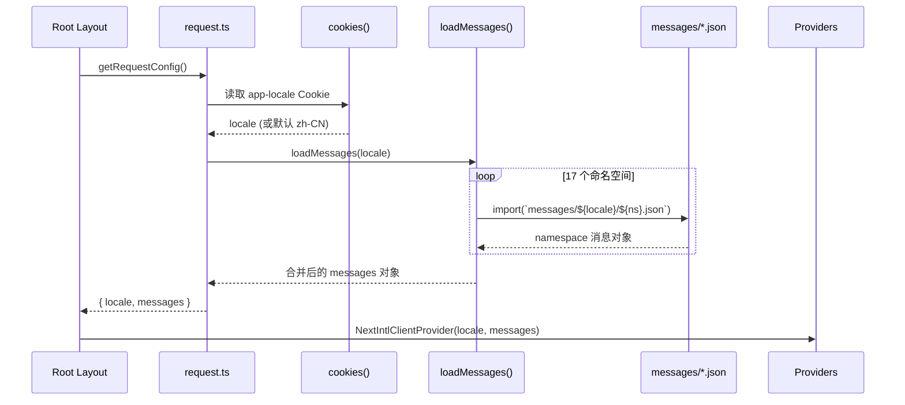
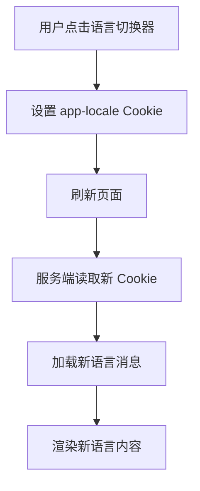

# 国际化方案

## 架构概览

项目使用 `next-intl` 4 实现国际化，采用 **Cookie 策略**（`localePrefix: "never"`），语言偏好存储在 Cookie 中，URL 不包含语言前缀。


## 语言配置

| 配置项 | 值 |
|--------|-----|
| 支持语言 | `zh-CN`（简体中文）、`en`（English） |
| 默认语言 | `zh-CN` |
| 路由策略 | `localePrefix: "never"` |
| Cookie 名称 | `app-locale` |

## 命名空间



消息文件按命名空间拆分存放：

```
messages/
├── zh-CN/
│   ├── common.json
│   ├── nav.json
│   ├── footer.json
│   ├── home.json
│   ├── features.json
│   ├── pricing.json
│   ├── about.json
│   ├── faq.json
│   ├── changelog.json
│   ├── contact.json
│   ├── blog.json
│   ├── privacy.json
│   ├── terms.json
│   ├── auth.json
│   ├── dashboard.json
│   ├── admin.json
│   └── errors.json
└── en/
    └── (同结构)
```

## 消息加载流程



## 使用方式

### 服务端组件

```tsx
import { getTranslations } from "next-intl/server"

export default async function Page() {
  const t = await getTranslations("dashboard")
  return <h1>{t("title")}</h1>
}
```

### 客户端组件

```tsx
import { useTranslations } from "next-intl"

function Component() {
  const t = useTranslations("common")
  return <p>{t("welcome")}</p>
}
```

### 导航 API

```tsx
import { Link, useRouter, usePathname, redirect } from "@/i18n/navigation"

// 内部链接
<Link href="/dashboard">{t("nav.dashboard")}</Link>

// 编程式导航
const router = useRouter()
router.push("/dashboard")
```

### 语言切换



```tsx
import { LocaleSwitcher } from "@/components/layout/locale-switcher"

// 语言切换器组件
<LocaleSwitcher />
```

## localeMeta 配置

```typescript
export const localeMeta: Record<Locale, { label: string; flag: string }> = {
  "zh-CN": { label: "简体中文", flag: "🇨🇳" },
  en: { label: "English", flag: "🇺🇸" },
};
```

## 安全函数

| 函数 | 功能 |
|------|------|
| `isValidLocale(locale)` | 判断字符串是否为支持的语言 |
| `getSafeLocale(locale)` | 获取安全语言值，无效则返回默认 |
