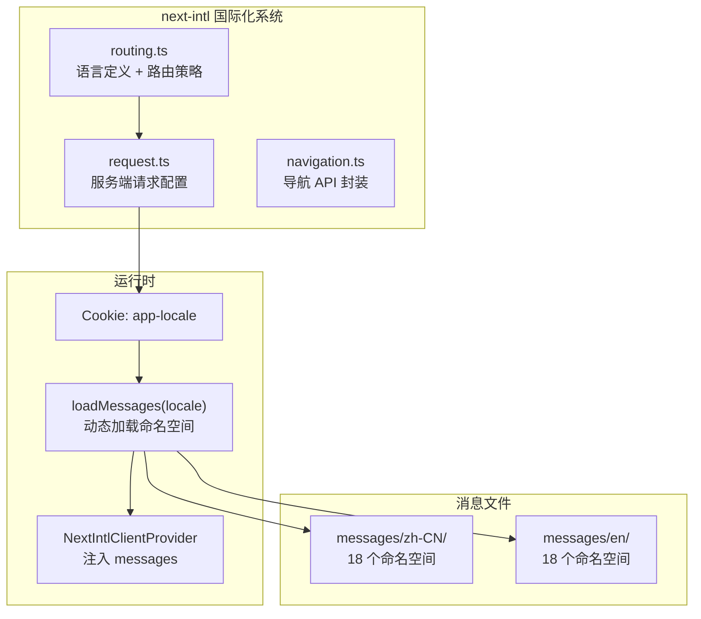
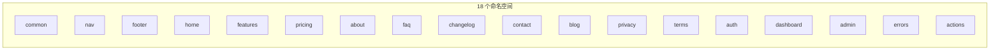
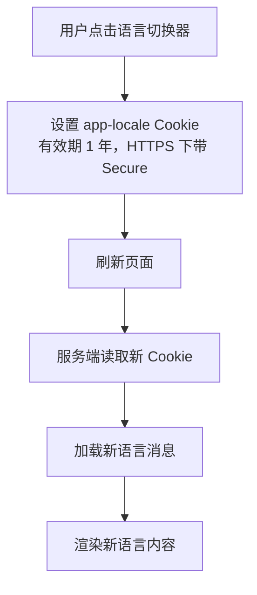

# 国际化方案

## 架构概览

项目使用 `next-intl` 4 实现国际化，采用 **Cookie 策略**（`localePrefix: "never"`），语言偏好存储在 Cookie 中，URL 不包含语言前缀。



## 语言配置

| 配置项 | 值 |
|--------|-----|
| 支持语言 | `zh-CN`（简体中文）、`en`（English） |
| 默认语言 | `en` |
| 路由策略 | `localePrefix: "never"` |
| Cookie 名称 | `app-locale` |

## 命名空间



消息文件按命名空间拆分存放：

```
messages/
├── zh-CN/
│   ├── common.json
│   ├── nav.json
│   ├── footer.json
│   ├── home.json
│   ├── features.json
│   ├── pricing.json
│   ├── about.json
│   ├── faq.json
│   ├── changelog.json
│   ├── contact.json
│   ├── blog.json
│   ├── privacy.json
│   ├── terms.json
│   ├── auth.json
│   ├── dashboard.json
│   ├── admin.json
│   ├── errors.json
│   └── actions.json
└── en/
    └── (同结构)
```

## 消息加载流程


## 使用方式

### 服务端组件

```tsx
import { getTranslations } from "next-intl/server"

export default async function Page() {
  const t = await getTranslations("dashboard")
  return <h1>{t("title")}</h1>
}
```

### 客户端组件

```tsx
import { useTranslations } from "next-intl"

function Component() {
  const t = useTranslations("common")
  return <p>{t("welcome")}</p>
}
```

### 导航 API

```tsx
import { Link, useRouter, usePathname, redirect } from "@/i18n/navigation"

// 内部链接
<Link href="/dashboard">{t("nav.dashboard")}</Link>

// 编程式导航
const router = useRouter()
router.push("/dashboard")
```

### 语言切换



```tsx
import { LocaleSwitcher } from "@/components/layout/locale-switcher"

// 语言切换器组件
<LocaleSwitcher />
```

## localeMeta 配置

```typescript
export const localeMeta: Record<Locale, { label: string; flag: string }> = {
  "zh-CN": { label: "简体中文", flag: "🇨🇳" },
  en: { label: "English", flag: "🇺🇸" },
};
```

## 安全函数

| 函数 | 功能 |
|------|------|
| `isValidLocale(locale)` | 判断字符串是否为支持的语言 |
| `getSafeLocale(locale)` | 获取安全语言值，无效则返回默认 |

## 翻译完整性门禁

`MISSING_MESSAGE` 只在静态生成时暴露，所以这三条门禁都是构建期必答项（`pnpm check:all` 与 CI 都跑）：

| 命令 | 挡住什么 | 规则本体 |
|------|----------|----------|
| `pnpm check:i18n` | 代码里引用了消息文件不存在的键 | `src/lib/i18n/**` |
| `pnpm check:locales` | 两侧键不对称；值未翻译；值是把键名/错误码当文案 | `src/lib/i18n/translation-values.ts` + `scripts/lib/locales-check.js` |
| `pnpm check:action-errors` | Server Action 错误码缺文案、各 locale 逐字相同、或前端裸渲染错误码 | `src/lib/i18n/action-errors.ts` |

`check:locales` 的键对称精确到**字符串叶子路径**（含消息数组下标）：`blog.posts.3.slug` 是一个键，
删掉一篇文章就等于两侧不对称。当前实测 en/zh-CN 各 1235 条叶子路径完全一致，值审计覆盖 2470 条文案。

值审计只有两条规则，但都必须成立：

- **该 locale 期望的文字必须出现**：`zh-CN` 的文案里一个汉字都没有即视为漏翻译
  （真实案例：`settings.sections.security.title` 长期是 `"Security"`，而同级 `danger` 分区早已是「危险区域」）；
- **值不得是内部标识符形状**：小写开头的驼峰单词（`projectNotFound`）出现在文案里，
  几乎总是「把错误码/键名当文案」的回声。该规则只对有文字系统要求的 locale 生效——
  英文里的 `and` / `days` 是正常词。

确实不翻译的值必须在 `scripts/lib/locales-check.js` 的 `UNTRANSLATED_VALUE_ALLOWLIST` **逐项登记理由**，
键形如 `zh-CN:blog.posts.*.slug`（`*` 只匹配单个路径段，因此放行 `slug` 不会顺手放行同数组的 `title`）。
两类情况同样失败：抽不到任何值（扫描范围写错不能伪装成「零问题」），以及登记项不再命中任何值
（例外清单不能只增不减）。新增 locale 时必须先在 `LOCALE_SCRIPT_REQUIREMENTS` 登记文字系统期望，
否则门禁直接报错——未分类不等于没问题。
