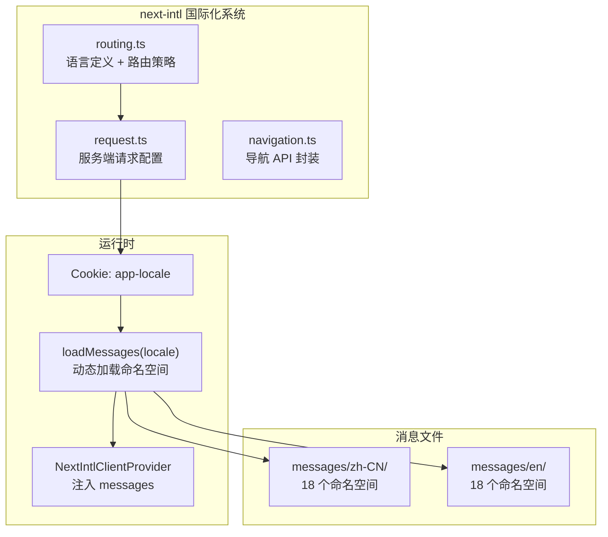
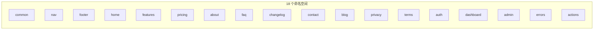
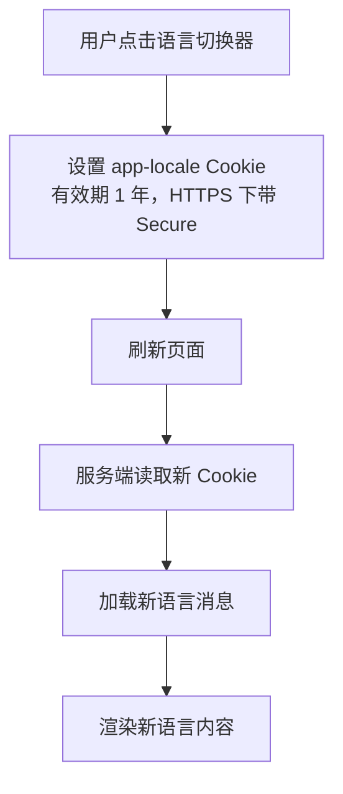

# 国际化方案

## 架构概览

项目使用 `next-intl` 4 实现国际化，采用 **Cookie 策略**（`localePrefix: "never"`），语言偏好存储在 Cookie 中，URL 不包含语言前缀。



## 语言配置

| 配置项 | 值 |
|--------|-----|
| 支持语言 | `zh-CN`（简体中文）、`en`（English） |
| 默认语言 | `en` |
| 路由策略 | `localePrefix: "never"` |
| Cookie 名称 | `app-locale` |

## 命名空间



消息文件按命名空间拆分存放：

```
messages/
├── zh-CN/
│   ├── common.json
│   ├── nav.json
│   ├── footer.json
│   ├── home.json
│   ├── features.json
│   ├── pricing.json
│   ├── about.json
│   ├── faq.json
│   ├── changelog.json
│   ├── contact.json
│   ├── blog.json
│   ├── privacy.json
│   ├── terms.json
│   ├── auth.json
│   ├── dashboard.json
│   ├── admin.json
│   ├── errors.json
│   └── actions.json
└── en/
    └── (同结构)
```

## 消息加载流程


## 使用方式

### 服务端组件

```tsx
import { getTranslations } from "next-intl/server"

export default async function Page() {
  const t = await getTranslations("dashboard")
  return <h1>{t("title")}</h1>
}
```

### 客户端组件

```tsx
import { useTranslations } from "next-intl"

function Component() {
  const t = useTranslations("common")
  return <p>{t("welcome")}</p>
}
```

### 导航 API

```tsx
import { Link, useRouter, usePathname, redirect } from "@/i18n/navigation"

// 内部链接
<Link href="/dashboard">{t("nav.dashboard")}</Link>

// 编程式导航
const router = useRouter()
router.push("/dashboard")
```

### 语言切换



```tsx
import { LocaleSwitcher } from "@/components/layout/locale-switcher"

// 语言切换器组件
<LocaleSwitcher />
```

## localeMeta 配置

```typescript
export const localeMeta: Record<Locale, { label: string; flag: string }> = {
  "zh-CN": { label: "简体中文", flag: "🇨🇳" },
  en: { label: "English", flag: "🇺🇸" },
};
```

## 安全函数

| 函数 | 功能 |
|------|------|
| `isValidLocale(locale)` | 判断字符串是否为支持的语言 |
| `getSafeLocale(locale)` | 获取安全语言值，无效则返回默认 |

## 术语表

翻译对了但用词不统一，用户看到的是同一个东西有两个名字：团队角色一度在成员列表里叫「拥有者」、
在错误提示里叫「所有者」，而这两处指的都是 `owner`。下表由 `pnpm check:glossary` 强制，
**表格与 `src/lib/i18n/glossary.ts` 的 `GLOSSARY` 必须逐项相等**，文档不能比规则更宽或更旧。

判定方式是「英文侧命中该术语 → 中文侧不得出现禁止变体」，且只有当指定译法**缺席**时才算违规：
一句话里可以同时翻译两个不同概念（`Manage your notification preferences and alerts` →
「管理你的通知偏好和提醒」，其中「提醒」译的是 `alerts`，不是 `notification` 的漂移）。
中文没出现指定译法也不算错误——翻译可以合理地绕开某个词，门禁只统计不失败。
消息数组（`terms.sections[].content`、`blog.posts[].content` 这类长文）不参与术语比对：
长文里一个术语可能出现多次、也可能被合理改写，逐条判定制裁不了什么，只会制造噪声。

| 英文术语 | 指定译法 | 禁止变体 | 说明 |
|---|---|---|---|
| `account` | 账户 | `账号`、`帐户` | 全站统一用「账户」 |
| `project` | 项目 | `工程`、`专案` | project 是产品内对象，不是软件工程 |
| `team` | 团队 | `小组`、`组织` | 全站统一用「团队」 |
| `member` | 成员 | `会员` | 「会员」是付费身份，团队成员不是会员 |
| `owner` | 所有者 | `拥有者`、`负责人` | 团队角色名统一为「所有者」 |
| `password` | 密码 | `口令` | 全站统一用「密码」 |
| `dashboard` | 仪表盘 | `仪表板`、`控制台` | 导航与标题统一为「仪表盘」 |
| `notification` | 通知 | `告警` | 「告警」保留给运维告警（Sentry / cron） |
| `settings` | 设置 | `设定` | 全站统一用「设置」 |
| `sign in` | 登录 | `登入`、`登陆` | 「登陆」是常见错别字，「登入」属台式用法 |
| `verify` | 验证 | `校验`、`核实` | 面向用户的核对统一为「验证」 |
| `invite` | 邀请 | `邀约` | 全站统一用「邀请」 |
| `subscription` | 订阅 | `订购`、`包月` | Stripe 周期订阅统一为「订阅」 |
| `api key` | 密钥 | `秘钥` | 「秘钥」是常见错别字 |

新增术语前先按当前文案实测：指定译法必须至少出现一次（否则门禁报 `GLOSSARY_ENTRY_UNUSED`，
僵尸规则一样是失败），禁止变体不得命中现有正确用法。确实要豁免某个键，在
`scripts/lib/glossary-check.js` 的 `GLOSSARY_EXEMPTIONS` 里登记 `zh-CN:<key>:<term>` 与理由，
豁免不再命中同样失败。

## 书写方向与长文本（D08）

当前只有 `en` 与 `zh-CN`，两者都是 LTR，所以「支持 RTL」不是本期目标；本期目标只有两个：
**新增代码不要把自己钉死在物理方向上**，以及**长文本不能撑破布局**。

- 应用层（`src/app/**`、`src/components/**`，排除 `src/components/ui/**`）已把
  **74 处**（33 个文件）物理方向类迁到逻辑方向：`ml-/mr-`→`ms-/me-`、`pl-/pr-`→`ps-/pe-`、
  `left-/right-`→`start-/end-`、`text-left/right`→`text-start/end`、
  `rounded-tl/tr/bl/br/l/r`→`rounded-ss/se/es/ee/s/e`、`border-l/r`→`border-s/e`。
  逻辑方向在 `dir="ltr"` 下与物理写法**渲染结果完全一致**，因此这次迁移不改变任何现有视觉；
  `pnpm check:direction` 要求应用层保持 0 处物理方向类，扫不到文件即失败封闭。
  验证方式不是截图而是两条可复算的事实：`src/app/layout.tsx` 的 `<html lang={locale}>` **不带
  `dir`**，`en` / `zh-CN` 因此都按 `ltr` 计算，`margin-inline-start` 即解析为 `margin-left`；
  再把一次全新 `pnpm build` 产出的 CSS 去转义后逐条比对，确认本次新写的 25 个逻辑类（74 处）
  各自仍生成一条规则，且值函数与物理写法一致（`.ms-2{margin-inline-start:calc(var(--spacing)*2)}`
  对 `.ml-2{margin-left:calc(var(--spacing)*2)}`）。这一步是必要的而非仪式：写错的逻辑类
  （例如把 `rounded-lg` 错替成 `rounded-sg`）**不会报错、只会静默不生成 CSS**。
- **`src/components/ui/**` 是刻意排除的**：35 处物理方向类仍在 9 个 shadcn 基元里，
  升级时会被上游覆盖，改在这里只会制造冲突。将来真要 RTL 时随供应商升级一起处理。
- **两处已知残留**：`translate-x-*`（11 处，抽屉/进度条的位移）与 `origin-left/right`
  （当前 0 处）在 Tailwind v4 里**没有逻辑等价物**，位移方向由 `--tw-translate-x` 决定，
  RTL 下需要按 `dir` 反号。这是留给未来的真实工作量，门禁因此不把二者列入禁止项
  ——要求一个没有替代写法的改动只会逼人加 `dir` 判断。
- 长文本：中文比英文短得多，但**德语等语言可长出一倍以上**，且 CJK 没有空格断行，
  一个长 token（邮箱、slug、`next-intl` 未命中时回退的键名）就能撑破 375px 视口。
  约定：可截断的文本给 `min-w-0` + `truncate`，需要换行的长 token 给 `break-words`，
  不要给固定宽度。`e2e/responsive.spec.ts` 在 375/768/1280 三个断点断言
  `documentElement` 无横向溢出，G06 修掉的容器溢出由它守住。

## 翻译完整性门禁

`MISSING_MESSAGE` 只在静态生成时暴露，所以这三条门禁都是构建期必答项（`pnpm check:all` 与 CI 都跑）：

| 命令 | 挡住什么 | 规则本体 |
|------|----------|----------|
| `pnpm check:i18n` | 代码里引用了消息文件不存在的键 | `src/lib/i18n/**` |
| `pnpm check:locales` | 两侧键不对称；值未翻译；值是把键名/错误码当文案 | `src/lib/i18n/translation-values.ts` + `scripts/lib/locales-check.js` |
| `pnpm check:action-errors` | Server Action 错误码缺文案、各 locale 逐字相同、或前端裸渲染错误码 | `src/lib/i18n/action-errors.ts` |

`check:locales` 的键对称精确到**字符串叶子路径**（含消息数组下标）：`blog.posts.3.slug` 是一个键，
删掉一篇文章就等于两侧不对称。当前实测 en/zh-CN 各 1235 条叶子路径完全一致，值审计覆盖 2470 条文案。

值审计只有两条规则，但都必须成立：

- **该 locale 期望的文字必须出现**：`zh-CN` 的文案里一个汉字都没有即视为漏翻译
  （真实案例：`settings.sections.security.title` 长期是 `"Security"`，而同级 `danger` 分区早已是「危险区域」）；
- **值不得是内部标识符形状**：小写开头的驼峰单词（`projectNotFound`）出现在文案里，
  几乎总是「把错误码/键名当文案」的回声。该规则只对有文字系统要求的 locale 生效——
  英文里的 `and` / `days` 是正常词。

确实不翻译的值必须在 `scripts/lib/locales-check.js` 的 `UNTRANSLATED_VALUE_ALLOWLIST` **逐项登记理由**，
键形如 `zh-CN:blog.posts.*.slug`（`*` 只匹配单个路径段，因此放行 `slug` 不会顺手放行同数组的 `title`）。
两类情况同样失败：抽不到任何值（扫描范围写错不能伪装成「零问题」），以及登记项不再命中任何值
（例外清单不能只增不减）。新增 locale 时必须先在 `LOCALE_SCRIPT_REQUIREMENTS` 登记文字系统期望，
否则门禁直接报错——未分类不等于没问题。
