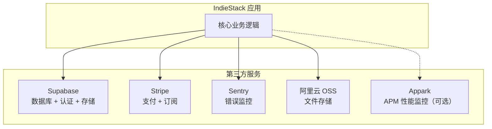
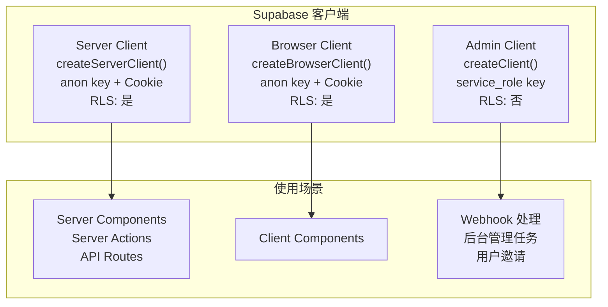
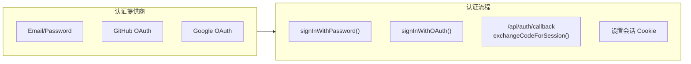
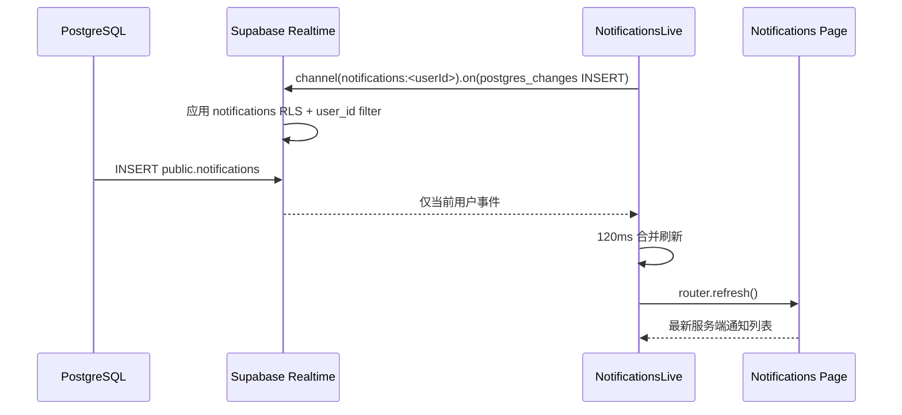
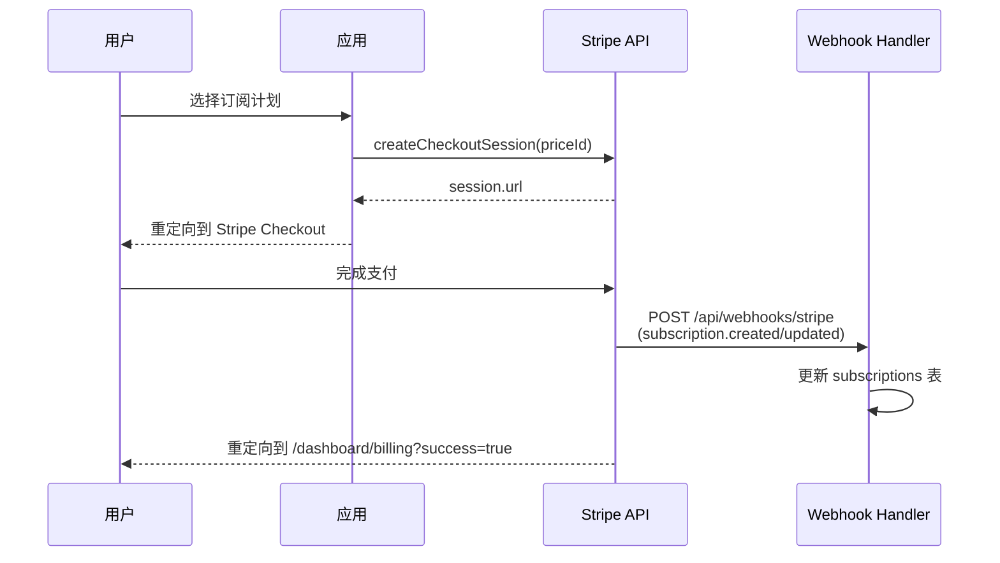
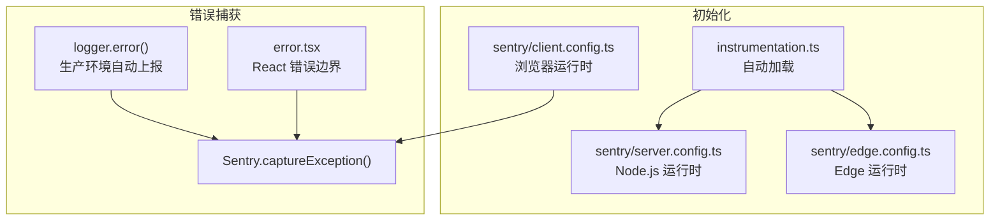

# 第三方集成

## 集成总览



## Supabase 集成

### 三种客户端



### 认证集成



### 环境变量

| 变量                            | 用途                               |
| ------------------------------- | ---------------------------------- |
| `NEXT_PUBLIC_SUPABASE_URL`      | Supabase 项目 URL                  |
| `NEXT_PUBLIC_SUPABASE_ANON_KEY` | 匿名密钥（客户端安全使用）         |
| `SUPABASE_SERVICE_ROLE_KEY`     | 服务角色密钥（仅服务端，绕过 RLS） |
| `SUPABASE_DB_URL`               | 直连数据库 URL                     |

### 通知 Realtime 数据流



- `supabase/migrations/025_notifications_realtime.sql` 幂等把 `public.notifications`
  加入 `supabase_realtime` publication；订阅者仍受表级 RLS 约束。
- 浏览器订阅契约位于 `src/components/dashboard/notifications-live.tsx`。Realtime 不可用时
  只把状态标记为 `offline`，不阻断初始页面数据。
- Mock 模式不建立 WebSocket；`src/lib/mock/index.ts` 提供同契约的
  `postgres_changes` 事件桥，供本地开发和 Playwright 验证刷新闭环。

### 本地开发

```bash
# 启动本地 Supabase（Auth + DB + Storage + Realtime）
npx supabase start

# 数据库迁移
pnpm db:migrate

# 生成类型
pnpm db:types

# 种子数据
pnpm db:seed
```

## Stripe 集成

### 支付流程



### API 接口

| 函数                                     | 端     | 功能                |
| ---------------------------------------- | ------ | ------------------- |
| `getStripe()`                            | 客户端 | 获取 Stripe.js 单例 |
| `redirectToCheckout(priceId)`            | 客户端 | 跳转到结账页        |
| `createCheckoutSession(priceId, params)` | 服务端 | 创建结账会话        |
| `createPortalSession(customerId)`        | 服务端 | 创建客户门户会话    |
| `getSubscription(subscriptionId)`        | 服务端 | 获取订阅信息        |
| `cancelSubscription(subscriptionId)`     | 服务端 | 取消订阅            |

### 环境变量

| 变量                                 | 用途                   |
| ------------------------------------ | ---------------------- |
| `STRIPE_SECRET_KEY`                  | Stripe 密钥（服务端）  |
| `NEXT_PUBLIC_STRIPE_PUBLISHABLE_KEY` | Stripe 公钥（客户端）  |
| `STRIPE_WEBHOOK_SECRET`              | Webhook 签名密钥       |
| `STRIPE_PRO_PRICE_ID`                | Pro 计划价格 ID        |
| `STRIPE_ENTERPRISE_PRICE_ID`         | Enterprise 计划价格 ID |

## Sentry 错误监控

### 初始化架构



### 环境变量

| 变量                     | 用途                      |
| ------------------------ | ------------------------- |
| `NEXT_PUBLIC_SENTRY_DSN` | Sentry DSN                |
| `SENTRY_ORG`             | 组织名                    |
| `SENTRY_PROJECT`         | 项目名                    |
| `SENTRY_AUTH_TOKEN`      | 认证令牌（Sourcaps 上传） |

### Sourcemaps

```bash
pnpm sentry:sourcemaps
# sentry-cli sourcemaps inject + upload
```

## 阿里云 OSS 文件存储

> 状态：**已接线（默认安全回退 Supabase Storage）**。
> `src/lib/storage/index.ts` 提供统一 `StorageDriver` contract；头像与项目封面通过 Server Actions
> 完成鉴权、白名单校验、服务端中转上传、数据库回写和对象生命周期清理。仅当 OSS 四项凭据
> (`OSS_BUCKET`、`OSS_REGION`、`OSS_ACCESS_KEY_ID`、`OSS_ACCESS_KEY_SECRET`) 完整时才启用 OSS，
> 配置不完整会显式诊断并回退 Supabase。

### 生命周期与失败恢复

- 数据库回写失败时回收刚上传对象，避免产生孤儿文件。
- 替换头像/项目封面时，只有通过 prefix 与租户边界校验的旧 URL 才会删除。
- 删除项目后回收受管项目封面；外部 CDN、跨租户 URL、路径穿越输入均不删除。
- 清理是 best-effort：provider 失败不会回滚已经成功的数据库写入，结构化日志会记录 operation、resourceId、key，供后续人工或定时修复。
- 清理统一经 `cleanupStorageObject` / `cleanupManagedStorageUrl`，避免各 action 自行实现不一致的安全边界。

### 当前限制与后续

当前上传为服务端中转并限制图片大小；尚未提供 provider 无关的对象列表/自动扫描 API。若需要批量
清理历史孤儿对象，应先增加受限的 list contract、dry-run 报告和租户级审计，再接入 cron，禁止直接
按 URL 或用户输入执行批量删除。

## Appark APM 性能监控（v0.5.0 已接线）

> 状态：**已接线**（ADR-011，轻量第一方封装，默认旁路关闭）。
> `src/lib/appark.ts`：`initAppark / trackEvent / trackError / flushEvents`；
> `src/instrumentation.ts` 初始化；埋点：Stripe 结账（`checkout.session_created`）、
> cron digest 运行指标（`cron.digest`）。错误主通道仍为 Sentry。

### 启用方式

- `NEXT_PUBLIC_APPARK_API_KEY` 与 `NEXT_PUBLIC_APPARK_ENDPOINT` **同时**配置才启用；
  只配其一会在 env 诊断中告警并保持旁路关闭。
- 事件批量 POST 到 endpoint（`Authorization: Bearer <key>`），
  schema：`{ events: [{ event, properties, timestamp, app_version }] }`。
- 详见 `docs/adr/adr-011-appark-apm.md`。

### 环境变量

| 变量                          | 用途                                  |
| ----------------------------- | ------------------------------------- |
| `NEXT_PUBLIC_APPARK_API_KEY`  | Appark API Key                        |
| `NEXT_PUBLIC_APPARK_ENDPOINT` | 事件收集端点                          |
| `NEXT_PUBLIC_APP_VERSION`     | 应用版本（覆盖 package.json version） |

## 环境变量总览

| 变量                                 | 服务                  | 必需 | 说明                              |
| ------------------------------------ | --------------------- | ---- | --------------------------------- |
| `NEXT_PUBLIC_APP_URL`                | 应用                  | 是   | 应用 URL                          |
| `NEXT_PUBLIC_APP_NAME`               | 应用                  | 否   | 应用名称（默认 IndieStack）       |
| `NEXT_PUBLIC_MOCK_ENABLED`           | Mock                  | 否   | 启用 Mock 模式                    |
| `NEXT_PUBLIC_SUPABASE_URL`           | Supabase              | 是*  | 项目 URL                          |
| `NEXT_PUBLIC_SUPABASE_ANON_KEY`      | Supabase              | 是*  | 匿名密钥                          |
| `SUPABASE_SERVICE_ROLE_KEY`          | Supabase              | 是   | 服务角色密钥                      |
| `STRIPE_SECRET_KEY`                  | Stripe                | 否   | Stripe 密钥                       |
| `NEXT_PUBLIC_STRIPE_PUBLISHABLE_KEY` | Stripe                | 否   | Stripe 公钥                       |
| `STRIPE_WEBHOOK_SECRET`              | Stripe                | 否   | Webhook 密钥                      |
| `NEXT_PUBLIC_SENTRY_DSN`             | Sentry                | 否   | Sentry DSN                        |
| `SENTRY_ORG`                         | Sentry                | 否   | 组织名                            |
| `SENTRY_PROJECT`                     | Sentry                | 否   | 项目名                            |
| `OSS_BUCKET`                         | OSS（ADR-010 双驱动） | 否   | 与 REGION/KEY/SECRET 四项齐备启用 |
| `OSS_REGION`                         | OSS                   | 否   | 区域                              |
| `OSS_ACCESS_KEY_ID`                  | OSS                   | 否   | AccessKey ID                      |
| `OSS_ACCESS_KEY_SECRET`              | OSS                   | 否   | AccessKey Secret                  |
| `NEXT_PUBLIC_APPARK_API_KEY`         | Appark（ADR-011）     | 否   | APM Key（与 ENDPOINT 同配）       |
| `NEXT_PUBLIC_APPARK_ENDPOINT`        | Appark                | 否   | 事件收集端点                      |

> *Supabase 变量在 Mock 模式下非必需
