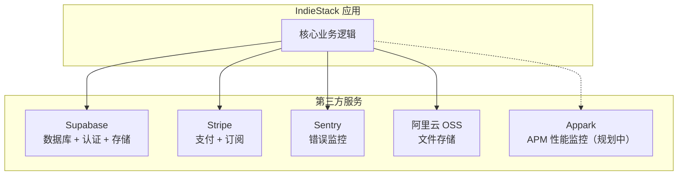
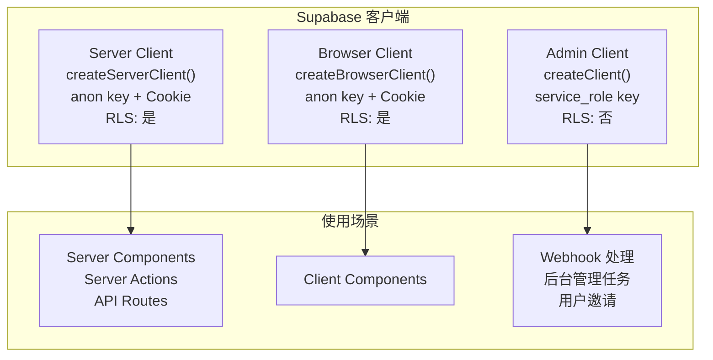
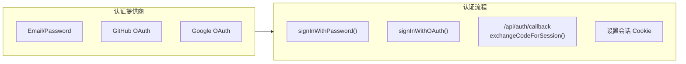
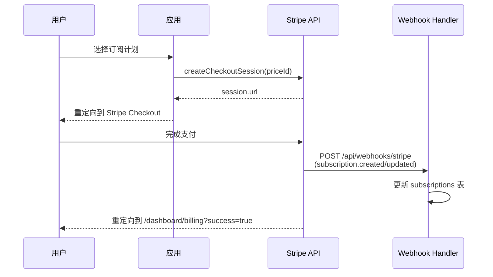
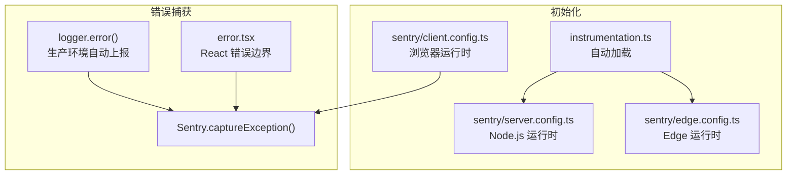

# 第三方集成

## 集成总览



## Supabase 集成

### 三种客户端



### 认证集成



### 环境变量

| 变量 | 用途 |
|------|------|
| `NEXT_PUBLIC_SUPABASE_URL` | Supabase 项目 URL |
| `NEXT_PUBLIC_SUPABASE_ANON_KEY` | 匿名密钥（客户端安全使用） |
| `SUPABASE_SERVICE_ROLE_KEY` | 服务角色密钥（仅服务端，绕过 RLS） |
| `SUPABASE_DB_URL` | 直连数据库 URL |

### 本地开发

```bash
# 启动本地 Supabase（Auth + DB + Storage + Realtime）
npx supabase start

# 数据库迁移
pnpm db:push

# 生成类型
pnpm db:types

# 种子数据
pnpm db:seed
```

## Stripe 集成

### 支付流程



### API 接口

| 函数 | 端 | 功能 |
|------|-----|------|
| `getStripe()` | 客户端 | 获取 Stripe.js 单例 |
| `redirectToCheckout(priceId)` | 客户端 | 跳转到结账页 |
| `createCheckoutSession(priceId, params)` | 服务端 | 创建结账会话 |
| `createPortalSession(customerId)` | 服务端 | 创建客户门户会话 |
| `getSubscription(subscriptionId)` | 服务端 | 获取订阅信息 |
| `cancelSubscription(subscriptionId)` | 服务端 | 取消订阅 |

### 环境变量

| 变量 | 用途 |
|------|------|
| `STRIPE_SECRET_KEY` | Stripe 密钥（服务端） |
| `NEXT_PUBLIC_STRIPE_PUBLISHABLE_KEY` | Stripe 公钥（客户端） |
| `STRIPE_WEBHOOK_SECRET` | Webhook 签名密钥 |
| `STRIPE_PRO_PRICE_ID` | Pro 计划价格 ID |
| `STRIPE_ENTERPRISE_PRICE_ID` | Enterprise 计划价格 ID |

## Sentry 错误监控

### 初始化架构



### 环境变量

| 变量 | 用途 |
|------|------|
| `NEXT_PUBLIC_SENTRY_DSN` | Sentry DSN |
| `SENTRY_ORG` | 组织名 |
| `SENTRY_PROJECT` | 项目名 |
| `SENTRY_AUTH_TOKEN` | 认证令牌（Sourcaps 上传） |

### Sourcemaps

```bash
pnpm sentry:sourcemaps
# sentry-cli sourcemaps inject + upload
```

## 阿里云 OSS 文件存储（规划中）

> 状态：**未接线**。OSS 上传模块当前仅为脚手架占位，未接入任何页面或 API 路由
> （历史代码已移除，避免误导）。如需启用，请按以下步骤补齐：

### 待办

1. 新建 `src/app/api/upload/route.ts`（服务端生成预签名 URL，使用 `ali-oss` SDK 签名）
2. 新建 `src/app/api/files/[key]/route.ts`（文件代理/访问）
3. 新建 `src/lib/storage/oss.ts`，封装 `uploadFile / deleteFile / getSignedUrl / listFiles`
4. 接入头像上传等客户端流程

### 环境变量（预留）

| 变量 | 用途 |
|------|------|
| `ALIYUN_ACCESS_KEY_ID` | 访问密钥 ID |
| `ALIYUN_ACCESS_KEY_SECRET` | 访问密钥 |
| `ALIYUN_BUCKET` | 存储桶名 |
| `ALIYUN_REGION` | 区域（默认 oss-cn-hangzhou） |
| `ALIYUN_CDN_DOMAIN` | CDN 域名 |

### Next.js 图片优化

> 启用 OSS 时，需在 `next.config.ts` 的 `images.remotePatterns` 中重新加入以下域名：

```typescript
// next.config.ts
images: {
  remotePatterns: [
    {
      protocol: "https",
      hostname: "*.oss-cn-hangzhou.aliyuncs.com",
      pathname: "/**",
    },
  ],
}
```

## Appark APM 性能监控（规划中）

> 状态：**未接线**。Appark APM 模块仅为脚手架占位，未在应用任何位置初始化
> （`src/lib/appark.ts` 已移除，避免误导）。如需启用，请按以下步骤补齐：

### 待办

1. 新建 `src/lib/appark.ts`，封装 `initAppark / trackEvent / trackError / flushEvents`
2. 在根布局或 `instrumentation.ts` 中调用 `initAppark()` 初始化
3. 在关键业务流程（注册、结账、错误）接入事件上报
4. 配置 `NEXT_PUBLIC_APPARK_API_KEY`

### 环境变量（预留）

| 变量 | 用途 |
|------|------|
| `NEXT_PUBLIC_APPARK_API_KEY` | Appark API Key |
| `NEXT_PUBLIC_APP_VERSION` | 应用版本 |

## 环境变量总览

| 变量 | 服务 | 必需 | 说明 |
|------|------|------|------|
| `NEXT_PUBLIC_APP_URL` | 应用 | 是 | 应用 URL |
| `NEXT_PUBLIC_APP_NAME` | 应用 | 否 | 应用名称（默认 IndieStack） |
| `NEXT_PUBLIC_MOCK_ENABLED` | Mock | 否 | 启用 Mock 模式 |
| `NEXT_PUBLIC_SUPABASE_URL` | Supabase | 是* | 项目 URL |
| `NEXT_PUBLIC_SUPABASE_ANON_KEY` | Supabase | 是* | 匿名密钥 |
| `SUPABASE_SERVICE_ROLE_KEY` | Supabase | 是 | 服务角色密钥 |
| `STRIPE_SECRET_KEY` | Stripe | 否 | Stripe 密钥 |
| `NEXT_PUBLIC_STRIPE_PUBLISHABLE_KEY` | Stripe | 否 | Stripe 公钥 |
| `STRIPE_WEBHOOK_SECRET` | Stripe | 否 | Webhook 密钥 |
| `NEXT_PUBLIC_SENTRY_DSN` | Sentry | 否 | Sentry DSN |
| `SENTRY_ORG` | Sentry | 否 | 组织名 |
| `SENTRY_PROJECT` | Sentry | 否 | 项目名 |
| `ALIYUN_BUCKET` | OSS | 否 | 存储桶 |
| `ALIYUN_REGION` | OSS | 否 | 区域 |
| `ALIYUN_CDN_DOMAIN` | OSS | 否 | CDN 域名 |
| `NEXT_PUBLIC_APPARK_API_KEY` | Appark（规划中） | 否 | APM Key |

> *Supabase 变量在 Mock 模式下非必需
