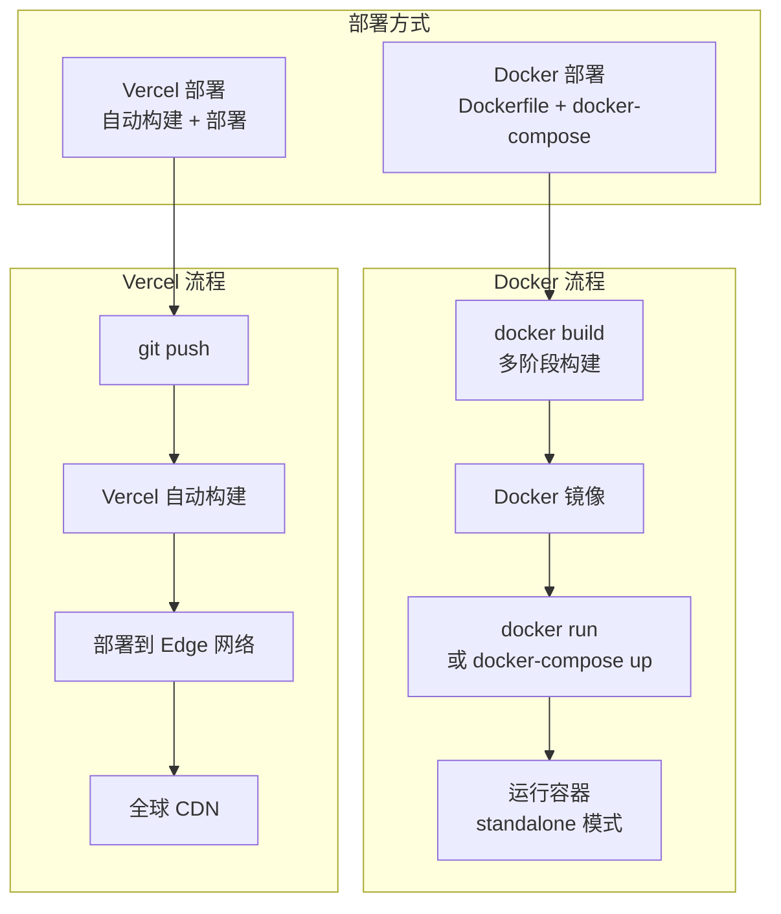
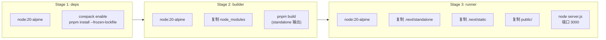
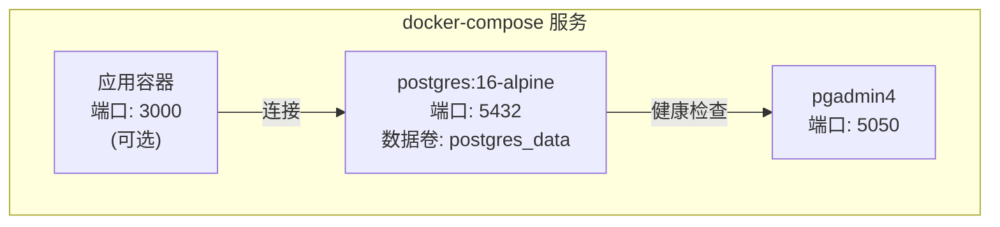
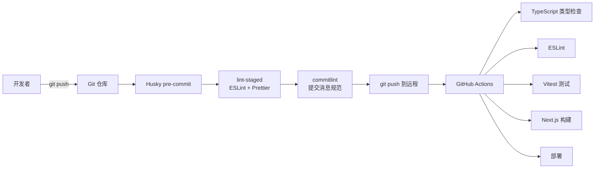
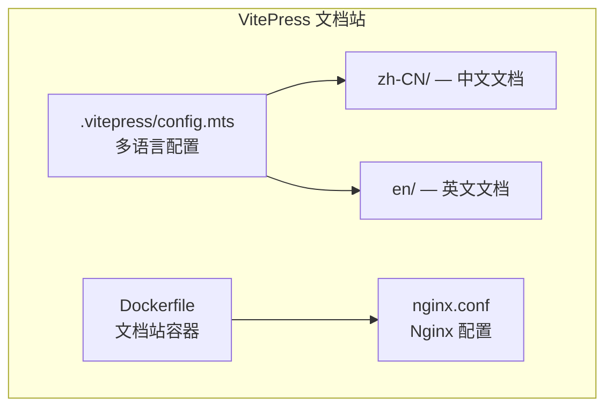

# 部署架构

## 部署方式

项目支持两种部署方式：**Docker 容器化部署** 和 **Vercel 平台部署**。



## Docker 部署

### 多阶段构建



### Dockerfile 关键配置

```dockerfile
FROM node:20-alpine AS deps
RUN corepack enable && pnpm install --frozen-lockfile

FROM node:20-alpine AS builder
COPY --from=deps /app/node_modules ./node_modules
RUN pnpm build  # output: "standalone"

FROM node:20-alpine AS runner
COPY --from=builder /app/.next/standalone ./
COPY --from=builder /app/.next/static ./.next/static
COPY --from=builder /app/public ./public
EXPOSE 3000
CMD ["node", "server.js"]
```

### docker-compose.yml



| 服务 | 镜像 | 端口 | 说明 |
|------|------|------|------|
| postgres | postgres:16-alpine | 5432 | 本地 PostgreSQL |
| pgadmin | dpage/pgadmin4 | 5050 | 数据库管理 UI |

### Docker 部署命令

```bash
# 构建镜像
docker build -t indiestack .

# 运行容器
docker run -p 3000:3000 --env-file .env.production indiestack

# 或使用 docker-compose
docker-compose up -d
```

## Vercel 部署

### 环境变量

在 Vercel 项目设置中配置所有环境变量（参考 `.env.example`）。

### 域名与重定向

```typescript
// next.config.ts
redirects: [
  { source: "/docs/:path*", destination: "${DOCS_URL}/:path*", permanent: false },
]
```

文档站独立部署在 `indiestack-docs.vercel.app`。

## CI/CD 流程



### 提交规范

使用 commitlint 强制 Conventional Commits 规范：

```
<type>(<scope>): <subject>

feat: 新功能
fix: 修复
docs: 文档
style: 格式
refactor: 重构
test: 测试
chore: 构建/工具
```

### 质量检查

| 检查项 | 命令 | 时机 |
|--------|------|------|
| 类型检查 | `pnpm type-check` | CI |
| Lint | `pnpm lint` | pre-commit + CI |
| 格式化 | `pnpm format` | pre-commit |
| 单元测试 | `pnpm test` | CI |
| 构建 | `pnpm build` | CI |


## 生产 Smoke 与版本漂移检测

`Production Smoke` workflow 提供两类无副作用证据：

- `workflow_dispatch` 的手动 `smoke` 作业：发布负责人显式传入生产 URL、期望版本和超时，生成 `production-smoke.json` 并保留 30 天 artifact（`production-smoke-evidence`）。该作业带作业级 `if: github.event_name == 'workflow_dispatch'`——`on:` 的 `schedule` 作用于所有作业，而它的参数只来自 dispatch inputs，定时触发时 inputs 为空，作业会在参数解析上失败并从未访问生产（这条守卫由 `pnpm check:production-smoke` 的 `SMOKE_MANUAL_TRIGGER_GUARD_MISSING` 守住）。
- `schedule` 的定时 `smoke-main` 作业：每日 UTC 02:17 从 `package.json` 读取期望版本，探测固定生产 URL，发现生产部署落后于仓库版本时失败，并把同一份证据文件保留为 **另一个名字**（`production-version-drift-evidence`）。两个作业在同一 run 里都上传时若用同一个 artifact 名，`gh run download -n` 只会留下后落地的那一份，发布证据的归属就不确定。

定时检查只检测 drift，不能替代发布前的完整手工证据；发布仍必须取得目标版本的 6/6 通过记录，并在 `.github/RELEASE_CHECKLIST.md` 与 `docs/operations/production-smoke-v<version>.md` 中填写时间和证据路径。

**commit 归属**：`/api/health` 除了 `version` 还暴露 `commit`（构建时内联的 `NEXT_PUBLIC_VERCEL_GIT_COMMIT_SHA`，回落到运行时 `VERCEL_GIT_COMMIT_SHA`，都没有则为 `null`）。`version` 只能说明「这是 0.11.0 的某个构建」，`commit` 才说明是哪一个，所以「部署 commit == 验证 commit」现在是一条可机读的证据：发布时的手动 smoke 用 `--expected-commit "$(git rev-parse HEAD)"`（短 SHA 按前缀匹配），生产上报不一致或不上报都判失败。定时 `smoke-main` **不**断言 commit，只把它写进证据文件——两次部署之间生产落后于 `main` 的 HEAD 是常态，把它变成硬断言只会让定时作业天天红在无关的事上。

## 文档站部署



文档站独立部署，支持中英双语，使用 VitePress 构建。

## 健康检查

```bash
# Docker HEALTHCHECK
curl http://localhost:3000/api/health

# 响应
{
  "status": "ok",
  "uptime": 3600,
  "checks": {
    "supabase": { "configured": true },
    "sentry": { "configured": true },
    "stripe": { "configured": true }
  }
}
```

## 环境配置文件

| 文件 | 用途 |
|------|------|
| `.env.example` | 环境变量模板 |
| `.env.local` | 本地开发（不提交） |
| `.env.development` | 开发环境 |
| `.env.production` | 生产环境 |
