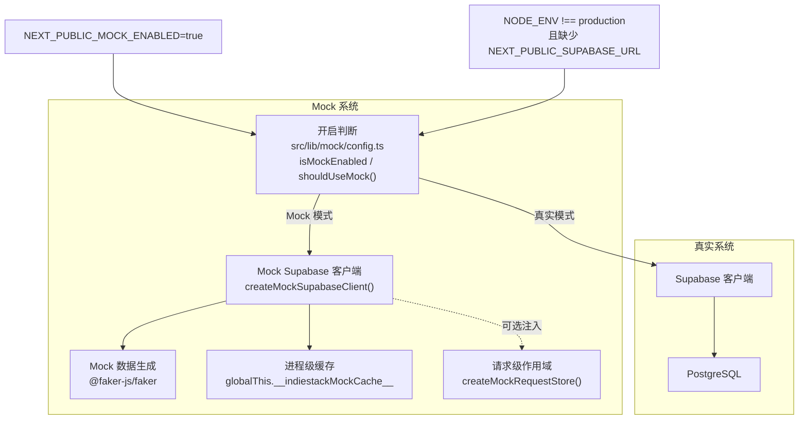
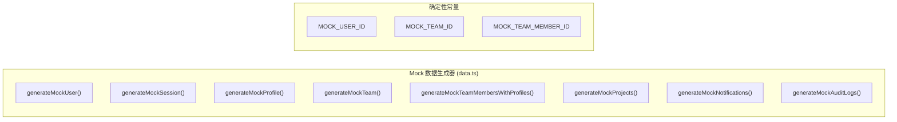
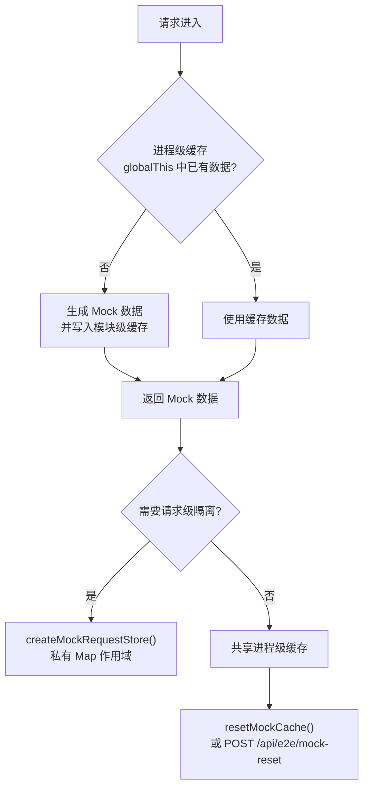
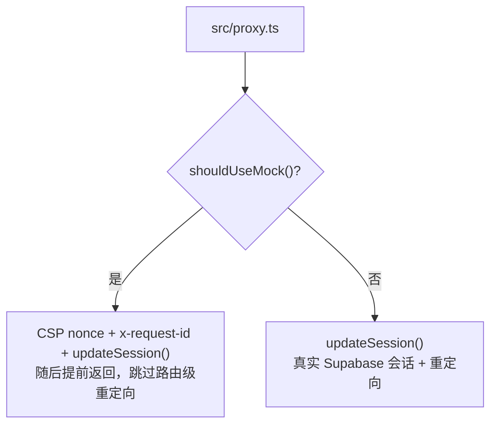

# Mock 开发模式

## 概述

项目内置 Mock 系统，无需真实 Supabase 后端即可完成本地开发、E2E 与 UI 调试。
Mock 数据由 `@faker-js/faker` 随机生成，但 spec 依赖的 ID 与时间戳保持确定性。

Mock 是**开发与测试加速器**，不是安全边界的替代品：它不校验 RLS、不投递真实邮件、
不连接真实 WebSocket。真实的租户隔离与策略验证走数据库身份矩阵
（`pnpm smoke:supabase-identity`）。



## 开启方式

`src/lib/mock/config.ts` 是唯一的开启判断，且刻意零依赖（不引入 `@faker-js/faker`），
以便 `src/proxy.ts` 在请求路径上引用而不增加运行时体积。

| 条件 | 说明 |
| ---- | ---- |
| `NEXT_PUBLIC_MOCK_ENABLED=true` | 显式启用 |
| `NODE_ENV !== "production"` 且缺少 `NEXT_PUBLIC_SUPABASE_URL` | 自动降级，仅限非生产环境 |

生产环境**不会**自动降级：缺少 Supabase URL 的线上部署应当显式失败，而不是静默返回
Mock 用户。`NEXT_PUBLIC_SUPABASE_ANON_KEY` 与该判断无关。

```bash
# 启动 Mock 模式开发
pnpm dev:mock

# 等价于
NEXT_PUBLIC_MOCK_ENABLED=true pnpm dev
```

## Mock 数据与表



`MockSupabaseClient` 的 `switch (this.table)` 分支决定了客户端支持的表集合：

| 表名 | 类型 | 说明 |
| ---- | ---- | ---- |
| `profiles` | 预置，可写 | Mock 用户资料，角色 `super_admin` |
| `teams` | 预置，可写 | 确定性团队 |
| `team_members` | 预置，可写 | 经 `applyRelationships()` 解析 |
| `team_members_with_profiles` | 预置，只读 | 成员列表联表视图 |
| `subscriptions` | 常量，只读 | 固定 `pro / active` |
| `notifications` | 预置，可写 | 驱动实时事件桥 |
| `audit_logs` | 预置，可写 | |
| `projects` | 预置，可写 | |
| `api_usage` | 预置，可写 | |
| `api_keys` | 预置，可写 | |
| `user_sessions` | 预置，可写 | |
| `email_worker_runs` | 预置，可写 | |
| `marketing_subscriptions` | 预置，可写 | |
| `contact_messages` | 预置，可写 | |
| `webhook_events` | 预置，可写 | |
| `push_delivery_attempts` | 预置，可写 | |
| `push_subscriptions` | 预置，可写 | |
| `upload_objects` | 预置，可写 | |

未知表名读取返回空结果、写入为空操作。`rpc()` 实现 `claim_webhook_event`、`erase_user_data`（镜像迁移 032 的擦除语义，见 `docs/db/retention.md`）以及 `list_user_objects_for_erasure` / `find_orphan_upload_objects`（镜像迁移 033 的对象引用判定，见 `docs/db/upload-metadata.md`）。

## 状态模型



- **进程级缓存**：模块级缓存镜像到 `globalThis.__indiestackMockCache__`。该跳板是必要的，
  Next.js dev 与生产构建都会把 Mock 模块拆成多个 chunk，缺少它时 RSC / 路由处理里的写入
  在后续 Server Action 中不可见（v0.5.0 实际踩到的跨 chunk 问题）。
- **重置**：`resetMockCache()` 清空全部缓存列表、Mock 用户/会话与 MFA 状态；
  运行中的 dev server 可以调用 `POST /api/e2e/mock-reset`（需要 `E2E_BEARER_TOKEN`）。
- **请求级隔离**：并行 spec 或并发场景测试使用 `createMockRequestStore()` 创建私有
  `Map` 作用域并注入客户端，避免共享可变状态互相覆盖。
- 仓库不使用 file-backed fixture 作为运行时数据源，原因见 `docs/testing.md`（F02/F03）。

## 接入点



| 接入点 | Mock 行为 |
| ------ | --------- |
| `src/proxy.ts` | 仍生成 CSP nonce、`x-request-id` 并执行 `updateSession()`，随后跳过路由级重定向 |
| 页面级守卫 | `requireRole()` / `requirePermission()` 仍然执行——被跳过的只是 proxy 的重定向层 |
| Supabase 服务端客户端 | 返回 Mock 客户端 |
| Supabase 浏览器客户端 | 返回 Mock 客户端 |
| Realtime | 服务端派发 `indiestack:mock-realtime` DOM 事件，不建立 WebSocket |
| 存储 | 占位 URL；`/api/e2e/mock-upload` 注入 `put()` 失败 |
| Push | `src/lib/mock/push-transport.ts` 只替换 `web-push` 底层 HTTP 传输，其余链路保持真实 |
| Admin 客户端 | 永不 Mock，service role 路径必须打真实数据库 |

## 仅 E2E 使用的端点

`src/app/api/e2e/` 下的端点只在 Mock 模式存在（否则 404），除特殊说明外都需要
`Authorization: Bearer <E2E_BEARER_TOKEN>`：

| 端点 | 方法 | 用途 |
| ---- | ---- | ---- |
| `/api/e2e/mock-reset` | POST | 清空进程级 Mock 缓存 |
| `/api/e2e/seed-notifications` | GET, POST | 写入通知并派发实时事件 |
| `/api/e2e/push-queue` | GET, POST | Push 订阅/投递记录与重试队列 |
| `/api/e2e/mock-upload` | GET, POST | 注入 `storage.put()` 失败 |
| `/api/e2e/email-inbox` | GET, POST, DELETE | 本地邮件收件箱 |
| `/api/e2e/email-worker-runs` | GET | cron worker run 记录 |
| `/api/e2e/webhook-events` | GET, DELETE | webhook 事件占位记录 |
| `/api/e2e/contact-messages` | GET, POST, DELETE | 联系表单提交 |

## 使用场景

| 场景 | 说明 |
| ---- | ---- |
| 前端 UI 开发 | 无需后端即可开发调试 |
| 新人入门 | 克隆项目即可运行，零配置 |
| 演示 / 原型 | 快速展示 UI 效果 |
| 组件开发 | 隔离前端与后端依赖 |
| E2E / 集成测试 | 确定性数据 + 受保护的重置端点 |

## 退出 Mock 模式

1. 配置 Supabase 环境变量（`.env.local`）
2. 设置 `NEXT_PUBLIC_MOCK_ENABLED=false`（或移除该变量）
3. 重启开发服务器

```bash
# .env.local
NEXT_PUBLIC_MOCK_ENABLED=false
NEXT_PUBLIC_SUPABASE_URL=https://your-project.supabase.co
NEXT_PUBLIC_SUPABASE_ANON_KEY=your-anon-key
```

## 文档一致性门禁

`pnpm check:mock-docs` 校验本文件、`docs-site/mock.md` 与 `docs-site/zh-CN/mock.md`
是否仍与实现一致：表名清单必须与 `src/lib/mock/index.ts` 的 `switch (this.table)` 分支
逐项相等，E2E 端点必须与 `src/app/api/e2e/*/route.ts` 一一对应，且每份文档必须覆盖开启
条件、自动降级边界、proxy 接入点与状态重置入口。规则实现位于
`src/lib/mock/mock-docs.ts`（纯函数），抽取结果为空时失败封闭。
