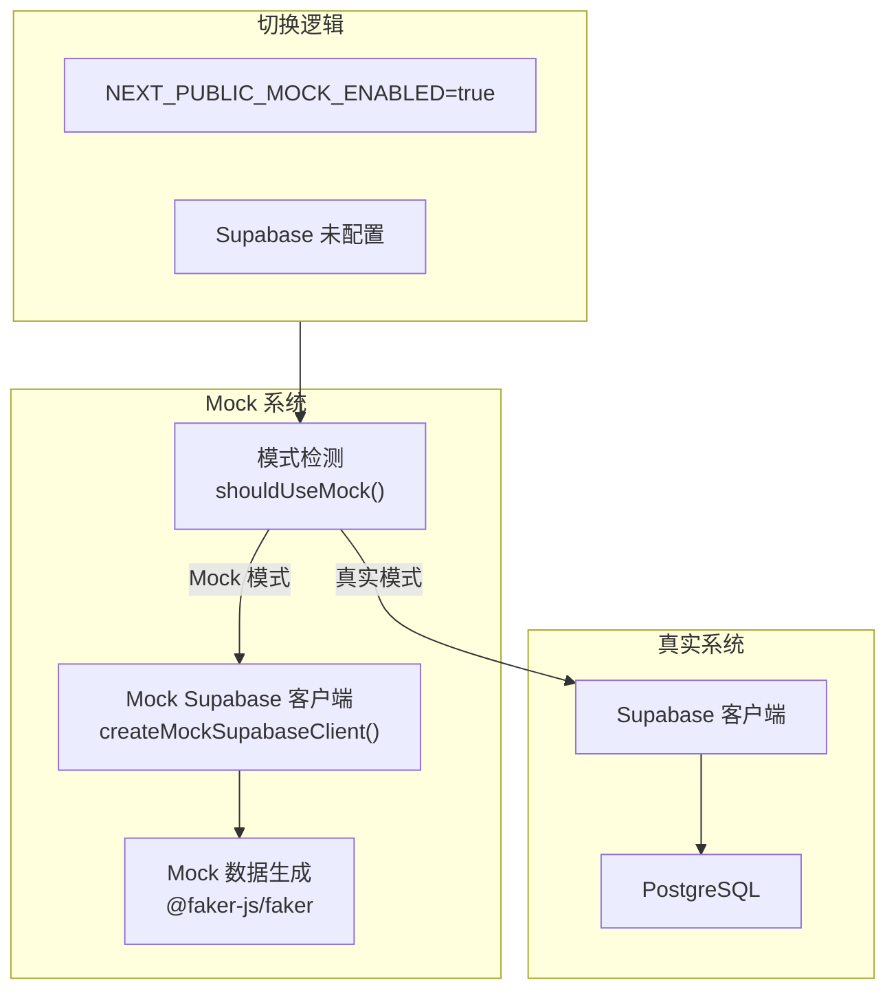
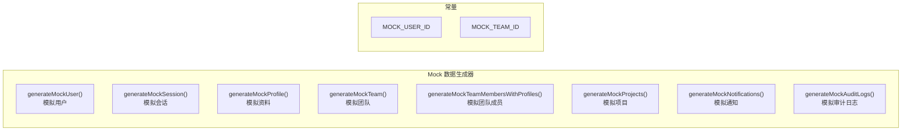
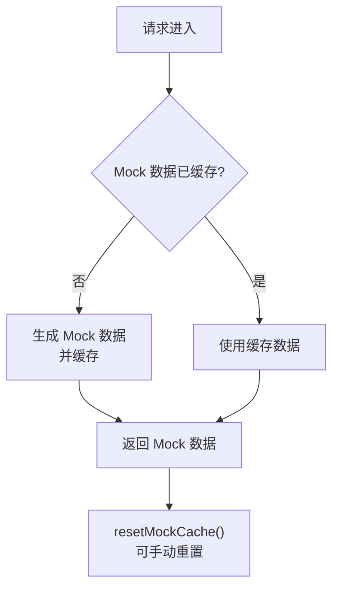
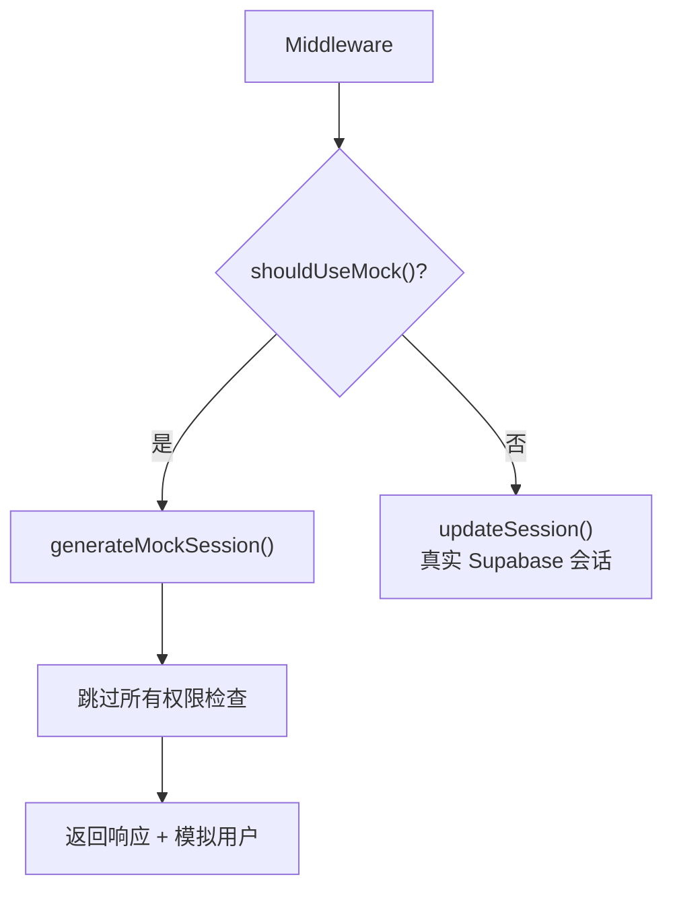
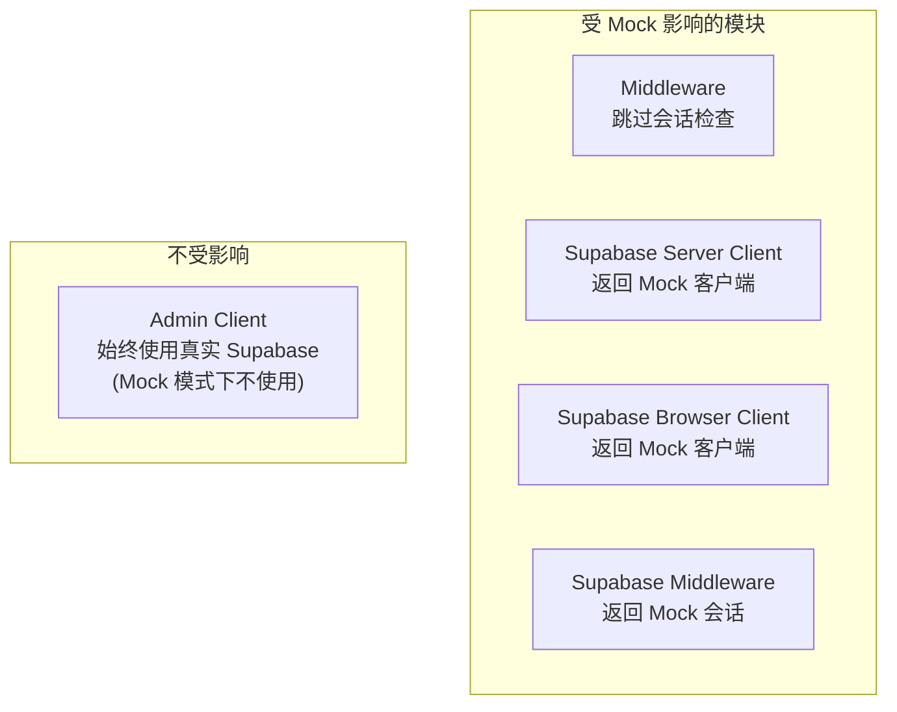

# Mock 开发模式

## 概述

项目内置 Mock 系统，允许在没有真实 Supabase 后端的情况下进行本地开发和 UI 调试。所有 Mock 数据由 `@faker-js/faker` 随机生成。



## 启用方式

Mock 模式在以下任一条件下自动启用：

| 条件 | 说明 |
|------|------|
| `NEXT_PUBLIC_MOCK_ENABLED=true` | 显式启用 |
| 未设置 `NEXT_PUBLIC_SUPABASE_URL` | Supabase 未配置时自动降级 |

```bash
# 启动 Mock 模式开发
pnpm dev:mock

# 等价于
NEXT_PUBLIC_MOCK_ENABLED=true pnpm dev
```

## Mock 数据



## 缓存机制



Mock 数据在一次请求内缓存，确保数据一致性。可通过 `resetMockCache()` 手动重置。

## Mock 客户端行为

Mock Supabase 客户端模拟以下接口：

| 接口 | 模拟行为 |
|------|----------|
| `auth.getUser()` | 返回 Mock 用户 |
| `from(table).select()` | 返回 Mock 数据 |
| `from(table).insert()` | 模拟插入成功 |
| `from(table).update()` | 模拟更新成功 |
| `from(table).delete()` | 模拟删除成功 |

## 中间件 Mock 行为



在 Mock 模式下，中间件跳过所有 Supabase 会话检查，直接返回模拟用户，所有路由保护失效。

## 影响范围



## 使用场景

| 场景 | 说明 |
|------|------|
| 前端 UI 开发 | 无需后端即可开发调试 |
| 新人入门 | 克隆项目即可运行，零配置 |
| 演示/原型 | 快速展示 UI 效果 |
| 组件开发 | 隔离前端与后端依赖 |

## 退出 Mock 模式

1. 配置 Supabase 环境变量（`.env.local`）
2. 设置 `NEXT_PUBLIC_MOCK_ENABLED=false`（或移除该变量）
3. 重启开发服务器

```bash
# .env.local
NEXT_PUBLIC_MOCK_ENABLED=false
NEXT_PUBLIC_SUPABASE_URL=https://your-project.supabase.co
NEXT_PUBLIC_SUPABASE_ANON_KEY=your-anon-key
```
