# 核心业务数据流程

## 用户注册流程

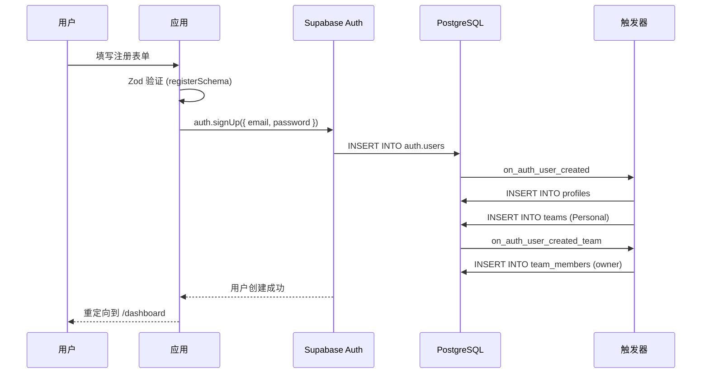
```mermaid
sequenceDiagram
    participant U as 用户
    participant App as 应用
    participant SB as Supabase Auth
    participant DB as PostgreSQL
    participant Trigger as 触发器

    U->>App: 填写注册表单
    App->>App: Zod 验证 (registerSchema)
    App->>SB: auth.signUp({ email, password })
    SB->>DB: INSERT INTO auth.users
    DB->>Trigger: on_auth_user_created
    Trigger->>DB: INSERT INTO profiles
    Trigger->>DB: INSERT INTO teams (Personal)
    DB->>Trigger: on_auth_user_created_team
    Trigger->>DB: INSERT INTO team_members (owner)
    SB-->>App: 用户创建成功
    App-->>U: 重定向到 /dashboard
```

## 用户登录流程

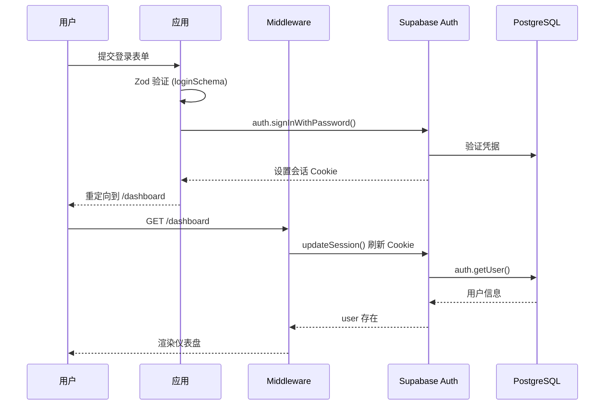
```mermaid
sequenceDiagram
    participant U as 用户
    participant App as 应用
    participant MW as Middleware
    participant SB as Supabase Auth
    participant DB as PostgreSQL

    U->>App: 提交登录表单
    App->>App: Zod 验证 (loginSchema)
    App->>SB: auth.signInWithPassword()
    SB->>DB: 验证凭据
    SB-->>App: 设置会话 Cookie
    App-->>U: 重定向到 /dashboard

    U->>MW: GET /dashboard
    MW->>SB: updateSession() 刷新 Cookie
    SB->>DB: auth.getUser()
    DB-->>SB: 用户信息
    SB-->>MW: user 存在
    MW-->>U: 渲染仪表盘
```

## OAuth 登录流程

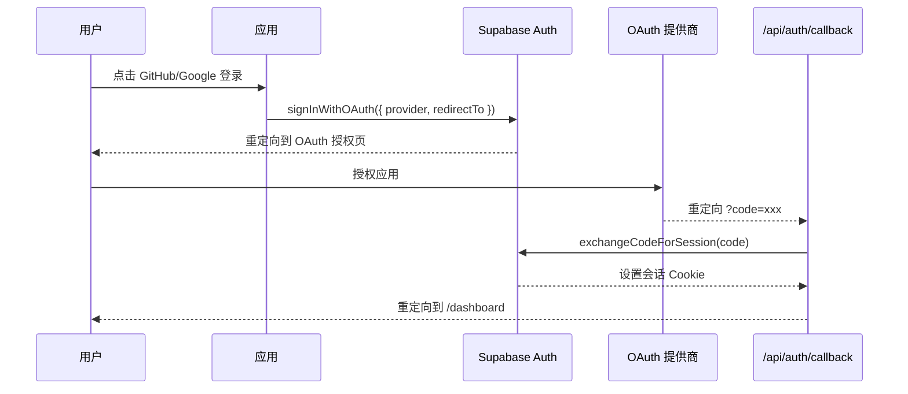
```mermaid
sequenceDiagram
    participant U as 用户
    participant App as 应用
    participant SB as Supabase Auth
    participant OAuth as OAuth 提供商
    participant CB as /api/auth/callback

    U->>App: 点击 GitHub/Google 登录
    App->>SB: signInWithOAuth({ provider, redirectTo })
    SB-->>U: 重定向到 OAuth 授权页
    U->>OAuth: 授权应用
    OAuth-->>CB: 重定向 ?code=xxx
    CB->>SB: exchangeCodeForSession(code)
    SB-->>CB: 设置会话 Cookie
    CB-->>U: 重定向到 /dashboard
```

## 团队邀请流程

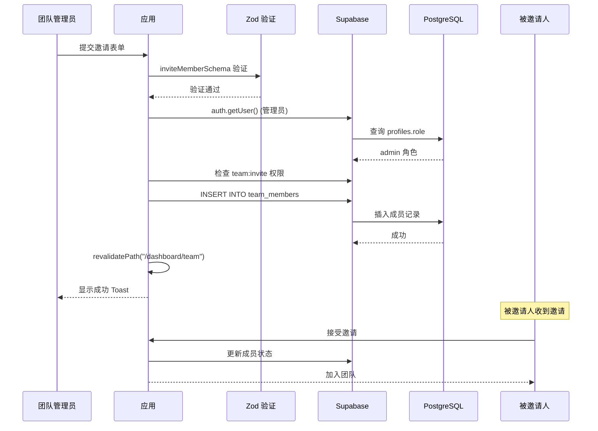
```mermaid
sequenceDiagram
    participant Owner as 团队管理员
    participant App as 应用
    participant V as Zod 验证
    participant SB as Supabase
    participant DB as PostgreSQL
    participant Invitee as 被邀请人

    Owner->>App: 提交邀请表单
    App->>V: inviteMemberSchema 验证
    V-->>App: 验证通过
    App->>SB: auth.getUser() (管理员)
    SB->>DB: 查询 profiles.role
    DB-->>SB: admin 角色
    App->>SB: 检查 team:invite 权限
    App->>SB: INSERT INTO team_members
    SB->>DB: 插入成员记录
    DB-->>SB: 成功
    App->>App: revalidatePath("/dashboard/team")
    App-->>Owner: 显示成功 Toast

    Note over Invitee: 被邀请人收到邀请
    Invitee->>App: 接受邀请
    App->>SB: 更新成员状态
    App-->>Invitee: 加入团队
```

## 订阅支付流程

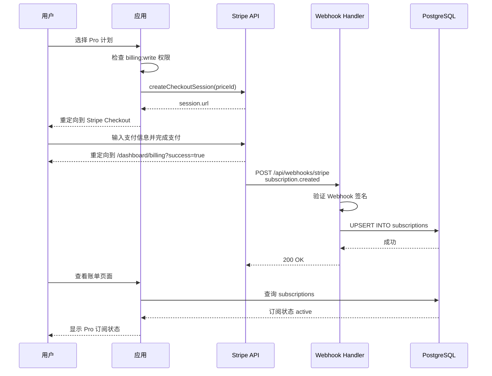
```mermaid
sequenceDiagram
    participant U as 用户
    participant App as 应用
    participant Stripe as Stripe API
    participant WH as Webhook Handler
    participant DB as PostgreSQL

    U->>App: 选择 Pro 计划
    App->>App: 检查 billing:write 权限
    App->>Stripe: createCheckoutSession(priceId)
    Stripe-->>App: session.url
    App-->>U: 重定向到 Stripe Checkout

    U->>Stripe: 输入支付信息并完成支付
    Stripe-->>U: 重定向到 /dashboard/billing?success=true
    Stripe->>WH: POST /api/webhooks/stripe<br/>subscription.created
    WH->>WH: 验证 Webhook 签名
    WH->>DB: UPSERT INTO subscriptions
    DB-->>WH: 成功
    WH-->>Stripe: 200 OK

    U->>App: 查看账单页面
    App->>DB: 查询 subscriptions
    DB-->>App: 订阅状态 active
    App-->>U: 显示 Pro 订阅状态
```

## 数据查询流程

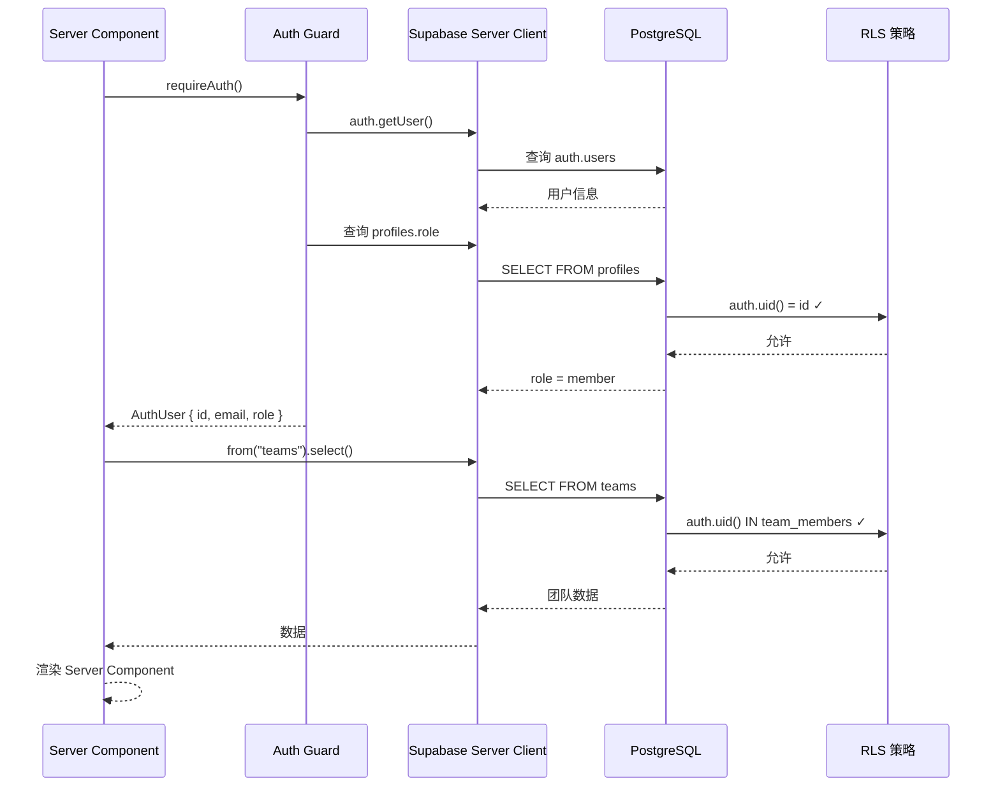
```mermaid
sequenceDiagram
    participant Page as Server Component
    participant Guard as Auth Guard
    participant SB as Supabase Server Client
    participant DB as PostgreSQL
    participant RLS as RLS 策略

    Page->>Guard: requireAuth()
    Guard->>SB: auth.getUser()
    SB->>DB: 查询 auth.users
    DB-->>SB: 用户信息
    Guard->>SB: 查询 profiles.role
    SB->>DB: SELECT FROM profiles
    DB->>RLS: auth.uid() = id ✓
    RLS-->>DB: 允许
    DB-->>SB: role = member
    Guard-->>Page: AuthUser { id, email, role }

    Page->>SB: from("teams").select()
    SB->>DB: SELECT FROM teams
    DB->>RLS: auth.uid() IN team_members ✓
    RLS-->>DB: 允许
    DB-->>SB: 团队数据
    SB-->>Page: 数据
    Page-->>Page: 渲染 Server Component
```

## 文件上传流程

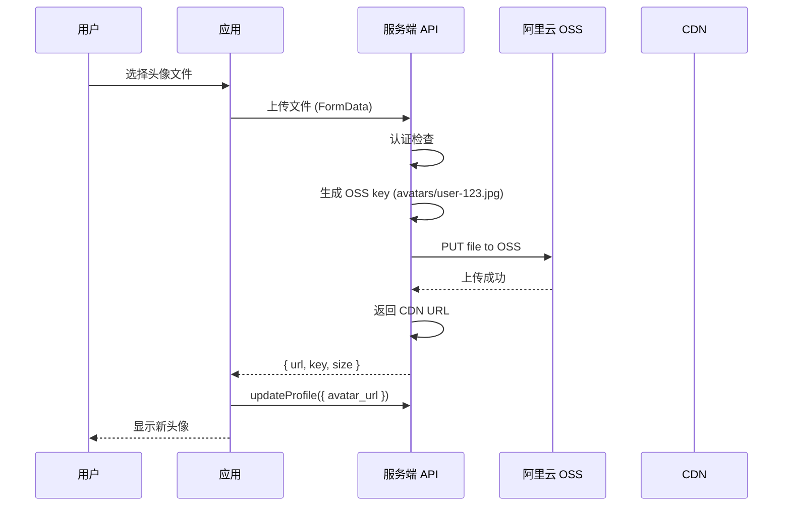
```mermaid
sequenceDiagram
    participant U as 用户
    participant App as 应用
    participant API as 服务端 API
    participant OSS as 阿里云 OSS
    participant CDN as CDN

    U->>App: 选择头像文件
    App->>API: 上传文件 (FormData)
    API->>API: 认证检查
    API->>API: 生成 OSS key (avatars/user-123.jpg)
    API->>OSS: PUT file to OSS
    OSS-->>API: 上传成功
    API->>API: 返回 CDN URL
    API-->>App: { url, key, size }
    App->>API: updateProfile({ avatar_url })
    App-->>U: 显示新头像
```

## 错误处理流程

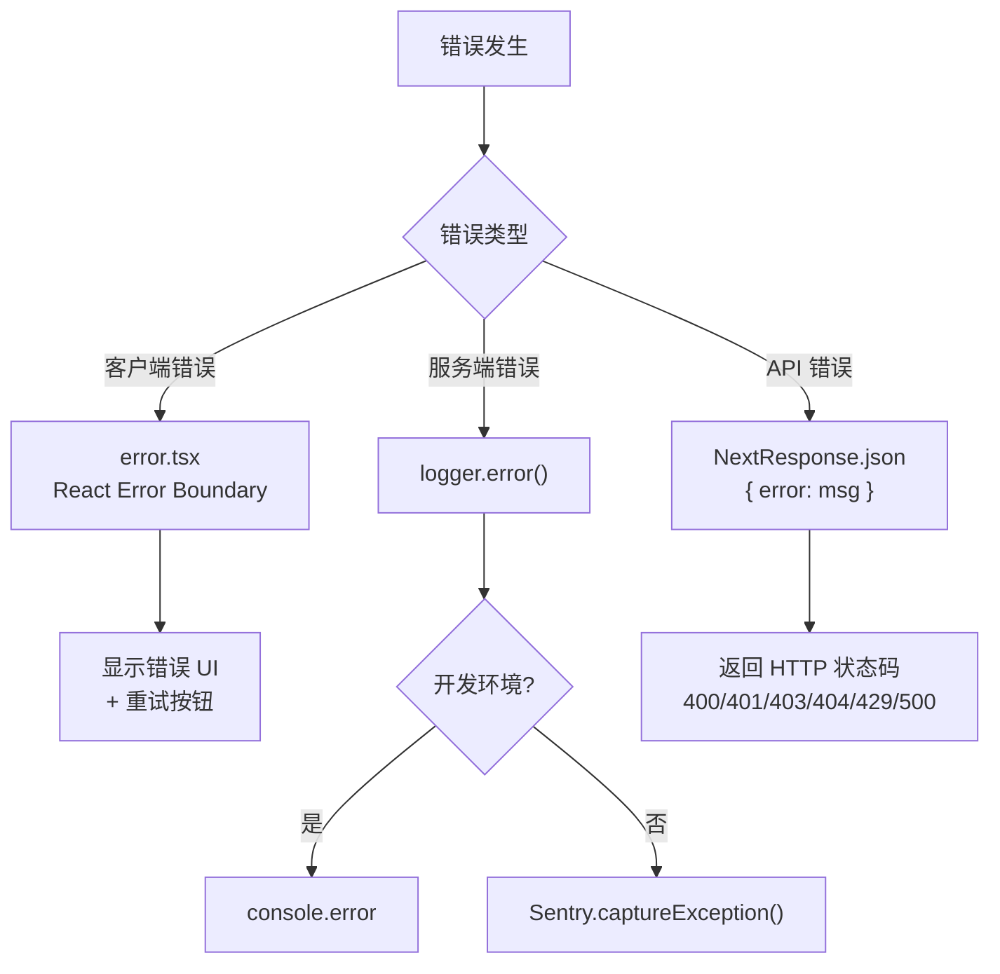
```mermaid
flowchart TD
    Error["错误发生"] --> Type{"错误类型"}
    Type -->|客户端错误| ErrorBoundary["error.tsx<br/>React Error Boundary"]
    Type -->|服务端错误| Logger["logger.error()"]
    Type -->|API 错误| APIError["NextResponse.json<br/>{ error: msg }"]

    ErrorBoundary --> ShowError["显示错误 UI<br/>+ 重试按钮"]
    Logger --> DevMode{"开发环境?"}
    DevMode -->|是| Console["console.error"]
    DevMode -->|否| Sentry["Sentry.captureException()"]
    APIError --> Status["返回 HTTP 状态码<br/>400/401/403/404/429/500"]
```

## 主题切换流程

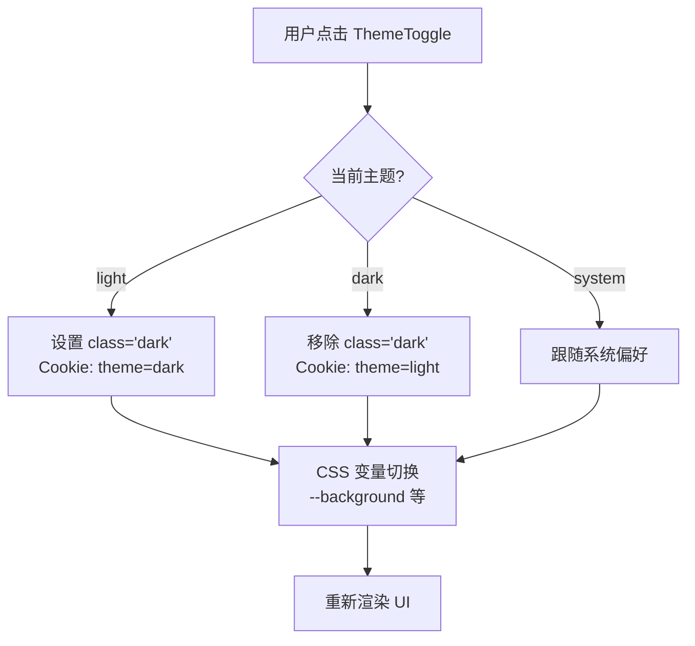
```mermaid
flowchart TD
    Toggle["用户点击 ThemeToggle"] --> Current{"当前主题?"}
    Current -->|light| SetDark["设置 class='dark'<br/>Cookie: theme=dark"]
    Current -->|dark| SetLight["移除 class='dark'<br/>Cookie: theme=light"]
    Current -->|system| SetSystem["跟随系统偏好"]

    SetDark --> ApplyCSS["CSS 变量切换<br/>--background 等"]
    SetLight --> ApplyCSS
    SetSystem --> ApplyCSS
    ApplyCSS --> Render["重新渲染 UI"]
```

## 语言切换流程

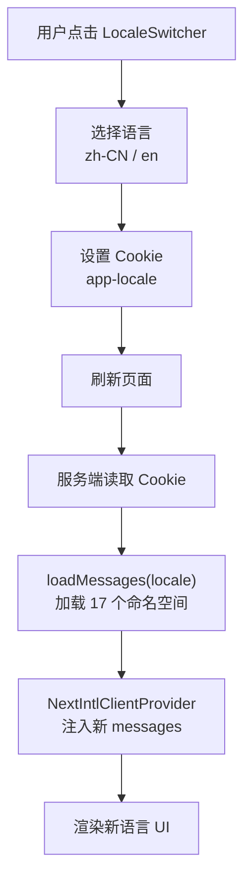
```mermaid
flowchart TD
    Switch["用户点击 LocaleSwitcher"] --> Select["选择语言<br/>zh-CN / en"]
    Select --> SetCookie["设置 Cookie<br/>app-locale"]
    SetCookie --> Reload["刷新页面"]
    Reload --> Server["服务端读取 Cookie"]
    Server --> LoadMsg["loadMessages(locale)<br/>加载 17 个命名空间"]
    LoadMsg --> Provider["NextIntlClientProvider<br/>注入新 messages"]
    Provider --> Render["渲染新语言 UI"]
```

## 速率限制流程

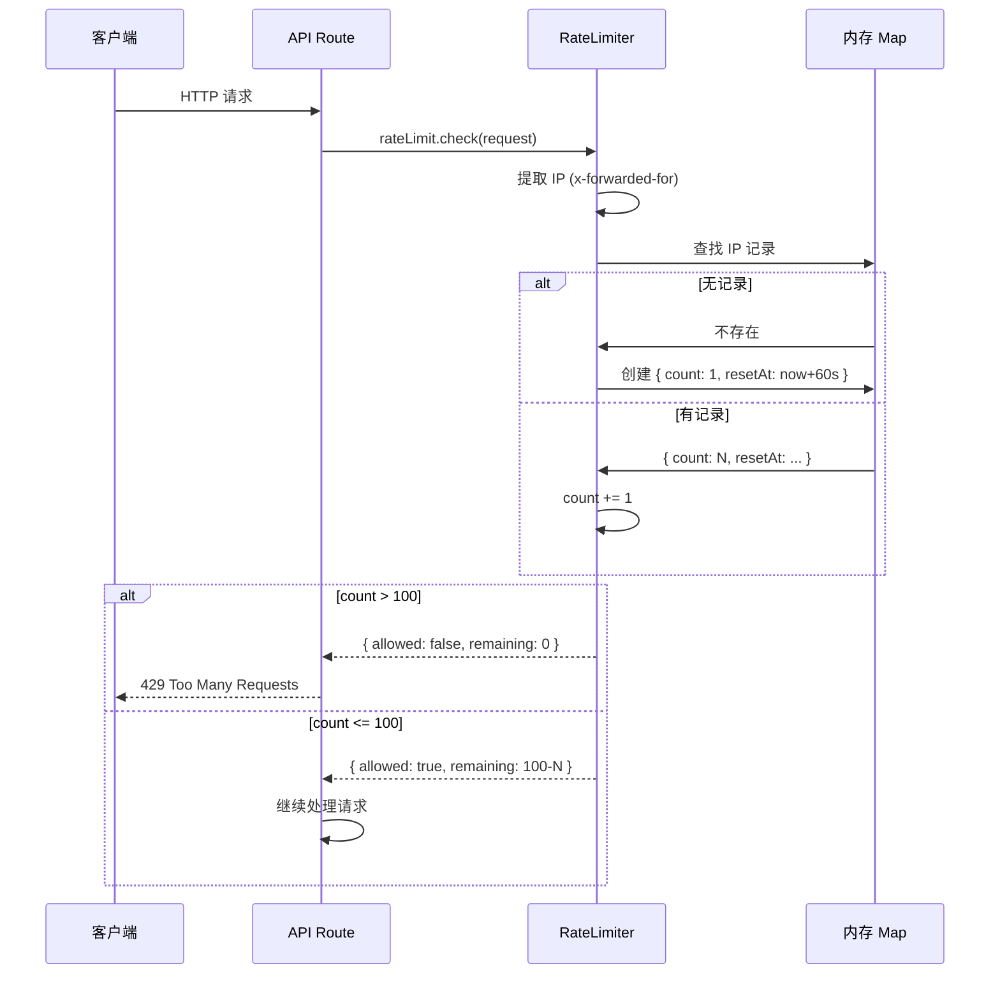
```mermaid
sequenceDiagram
    participant C as 客户端
    participant API as API Route
    participant RL as RateLimiter
    participant Map as 内存 Map

    C->>API: HTTP 请求
    API->>RL: rateLimit.check(request)
    RL->>RL: 提取 IP (x-forwarded-for)
    RL->>Map: 查找 IP 记录
    alt 无记录
        Map->>RL: 不存在
        RL->>Map: 创建 { count: 1, resetAt: now+60s }
    else 有记录
        Map->>RL: { count: N, resetAt: ... }
        RL->>RL: count += 1
    end
    alt count > 100
        RL-->>API: { allowed: false, remaining: 0 }
        API-->>C: 429 Too Many Requests
    else count <= 100
        RL-->>API: { allowed: true, remaining: 100-N }
        API->>API: 继续处理请求
    end
```
